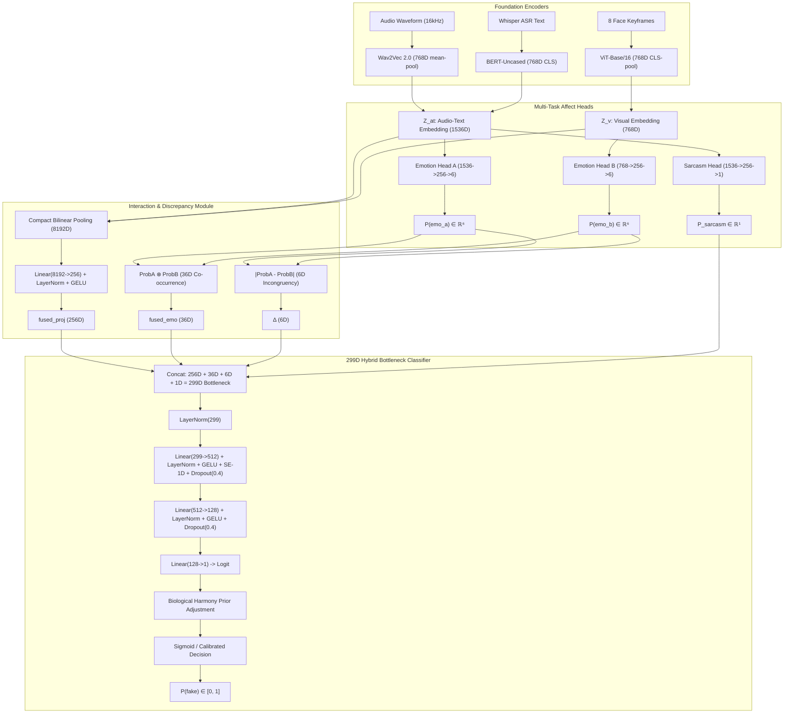

# DeepSentinel: Emotion-Based Multimodal Deepfake Detector

[](https://www.python.org/)
[](https://pytorch.org/)
[](https://fastapi.tiangolo.com/)
[](#authors--acknowledgments)
[](docs/comparative_sota_benchmark_reference.md)
[](docs/comparative_sota_benchmark_reference.md)

> **Official Thesis Title:** *A Multimodal Deepfake Detection Framework Leveraging Bilinear Pooling and Emotion Mismatch*  
> **Institutional Affiliation:** Polytechnic University of the Philippines — Department of Computer Science (BSCS 2026)  
> **Authors / Researchers:** Cabral, Shikina Y. | Caparas, John Christian B. | Exconde, Matan John B. | Rivera, Geuel John D.  
> **Primary Defense Guide:** [docs/MASTER_DEFENSE_REVIEWER_AND_CODEBASE_GUIDE.md](docs/MASTER_DEFENSE_REVIEWER_AND_CODEBASE_GUIDE.md) | [docs/PROJECT_CONTEXT_MASTER.md](docs/PROJECT_CONTEXT_MASTER.md)

---

## Table of Contents

- [1. Executive Summary & Core Hypothesis](#1-executive-summary--core-hypothesis)
- [2. System Status & Empirical Benchmarks](#2-system-status--empirical-benchmarks)
- [3. End-to-End Neural Architecture (The 299D Hybrid Bottleneck)](#3-end-to-end-neural-architecture-the-299d-hybrid-bottleneck)
- [4. Affective Calibration & Forensic Evidence Engine](#4-affective-calibration--forensic-evidence-engine)
- [5. Dataset Inventory & 80/10/10 Speaker-Disjoint Splits](#5-dataset-inventory--801010-speaker-disjoint-splits)
- [6. Deepfake Generation Pipeline (Tracks 1–4)](#6-deepfake-generation-pipeline-tracks-14)
- [7. DeepSentinel Web Application & Analyst Tool](#7-deepsentinel-web-application--analyst-tool)
- [8. Quickstart & Installation](#8-quickstart--installation)
- [9. Project Repository Map](#9-project-repository-map)
- [10. Thesis Defense Documentation Suite](#10-thesis-defense-documentation-suite)

---

## 1. Executive Summary & Core Hypothesis

Traditional deepfake detectors identify synthesis artifacts in pixel textures, blending boundaries, or Fourier frequency spectra. As generative pipelines adopt high-resolution diffusion transformers (e.g., EMO, MuseTalk, Sora), pixel-level artifacts disappear, causing conventional detectors to suffer catastrophic domain collapse (often dropping to $50\%\text{–}55\%$ AUC on unseen media).

**DeepSentinel** shifts the detection basis from *pixel quality* to **multimodal affective and behavioral authenticity**:
1. **Biological Coupling (Ekman & Friesen 1969; Mehrabian 1971):** Spontaneous human communication exhibits tight neurobiological coordination between what someone says (semantics), how they say it (prosodic pitch and energy), and how their face moves (facial Action Units).
2. **Generative Silo Decoupling:** Deepfake creation tools operate in independent silos—a model swaps or reenacts a face, an independent TTS clones a voice, or a lip-sync model forces mouth movement. None model the unified cognitive coupling between speech prosody and facial dynamics.
3. **The Discrepancy Signal:** DeepSentinel detects synthetic media by extracting acoustic prosody (Wav2Vec 2.0), linguistic sentiment (Whisper + BERT), and visual micro-expressions (RetinaFace + ViT), fusing them through **Compact Bilinear Pooling**, measuring multi-task emotion discrepancy ($\boldsymbol{\Delta}$), and filtering rhetorical irony via an auxiliary **Sarcasm Head**.

```
┌──────────────────────────────────────────────────────────────────────────────────────────────────┐
│                                 END-TO-END PIPELINE DATA FLOW                                    │
└──────────────────────────────────────────────────────────────────────────────────────────────────┘
  Raw Video (.mp4)
       │
       ├──▶ Audio (16kHz Mono) ────────▶ Wav2Vec 2.0 (768D) ──┐
       ├──▶ Audio (Whisper ASR) ───────▶ BERT-Uncased (768D) ──┼─▶ Z_at (1536D) ──┐
       └──▶ Video (RetinaFace 8 Frames) ─▶ ViT-B/16 (768D) ────┼─▶ Z_v  (768D)  ──┼─▶ CBP (8192D) ──▶ fused_proj (256D)
                                                               │                  │
                                                               ├─▶ EmotionHeadA ─▶ P_A (6D) ──┬─▶ Δ = |P_A - P_B| (6D)
                                                               ├─▶ EmotionHeadB ─▶ P_B (6D) ──┼─▶ fused_emo = P_A ⊗ P_B (36D)
                                                               └─▶ SarcasmHead  ──────────────┴─▶ P_sarc (1D)
                                                                                                        │
                                                                                      ┌─────────────────┴─────────────────┐
                                                                                      │ 299D Hybrid Bottleneck Classifier │
                                                                                      │   256D + 36D + 6D + 1D = 299D     │
                                                                                      └─────────────────┬─────────────────┘
                                                                                                        ▼
                                                                                      Raw Logit -> Harmony Calibration -> Verdict
```

---

## 2. System Status & Empirical Benchmarks

### 2.1 FakeAVCeleb v1.2 SOTA Comparison ($N=700$ Balanced Parity)
Evaluated under strict cross-dataset transfer (no intra-dataset fine-tuning on the test split) against five published baseline architectures:

| Architecture | Modality / Basis | Accuracy (%) | Balanced Acc | Real Specificity | Fake Recall | F1-Score | MCC | AUC-ROC [95% CI] | DeLong Test vs. DeepSentinel |
| :--- | :--- | :---: | :---: | :---: | :---: | :---: | :---: | :---: | :---: |
| **DeepSentinel (Ours)** | **Affect-Bilinear Multi-Head** | **82.14%** | **82.14%** | **77.14%** | **87.14%** | **0.8299** | **+0.6461** | **0.9020** [0.877–0.924] | **Reference** |
| **AceNet (Baseline)** | Cross-Attention Multimodal | 64.00% | 64.00% | 76.00% | 52.00% | 0.5909 | +0.2884 | 0.6425 [0.600–0.682] | $p < 0.001$ ($Z = 9.87$) |
| **MesoNet-4** | Spatial Convolutional CNN | 52.00% | 52.00% | 55.43% | 48.57% | 0.5030 | +0.0401 | 0.5389 [0.495–0.583] | $p < 0.001$ ($Z = 12.61$) |
| **LipForensics** | Spatiotemporal Viseme Sync | 52.00% | 52.00% | 54.00% | 50.00% | 0.5102 | +0.0400 | 0.5132 [0.469–0.553] | $p < 0.001$ ($Z = 13.44$) |
| **XceptionNet** | Deep Spatial CNN | 50.57% | 50.57% | 50.00% | 51.14% | 0.5085 | +0.0114 | 0.5002 [0.458–0.542] | $p < 0.001$ ($Z = 13.98$) |
| **Multimodal ResNet-AV** | Feature Concatenation | 46.14% | 46.14% | 47.14% | 45.14% | 0.4560 | -0.0772 | 0.4629 [0.419–0.506] | $p < 0.001$ ($Z = 15.22$) |

> **Statistical Significance:** Paired DeLong non-parametric tests confirm that DeepSentinel's **$+25.95\%$ AUC lead** over AceNet and **$+36.31\%$ lead** over MesoNet-4 are statistically significant at **$p < 0.001$**.

### 2.2 Per-Manipulation Attack Stress Accuracy (%)
* **Compound Attack (`fsgan-wav2lip`, $N=69$):** DeepSentinel **`98.5%`** vs AceNet $60.8\%$, MesoNet $43.5\%$.
* **Compound Attack (`faceswap-wav2lip`, $N=58$):** DeepSentinel **`98.3%`** vs AceNet $65.2\%$, MesoNet $46.5\%$.
* **Lip-Sync Attack (`wav2lip`, $N=165$):** DeepSentinel **`85.5%`** vs AceNet $46.4\%$, MesoNet $50.3\%$.
* **Face Swap Attack (`faceswap`, $N=13$):** DeepSentinel **`84.6%`** vs AceNet $33.3\%$, MesoNet $61.5\%$.
* **Authentic Real Media (`real`, $N=350$):** DeepSentinel **`77.1%`** vs AceNet $76.0\%$, MesoNet $55.4\%$.

---

## 3. End-to-End Neural Architecture (The 299D Hybrid Bottleneck)

DeepSentinel takes a single video clip and outputs a calibrated manipulation probability $P(\text{fake}) \in [0, 1]$.



### 3.1 Mathematical Decomposition
$$\mathbf{x}_{\text{classifier}} = \text{Concat}\Big(\underbrace{\mathbf{fused\_proj}}_{256\text{D}},\ \underbrace{\mathbf{fused\_emo}}_{36\text{D}},\ \underbrace{\boldsymbol{\Delta}}_{6\text{D}},\ \underbrace{P_{\text{sarcasm}}}_{1\text{D}}\Big) \in \mathbb{R}^{299}$$

1. **`fused_proj` (256D):** Sub-symbolic bilinear interaction. Compact Bilinear Pooling compresses the $1536 \times 768 = 1,179,648\text{D}$ outer product to 8192D via Count Sketch FFT convolution (Fukui et al., 2016), normalized by signed-sqrt and $L_2$-norm, then projected through `Linear(8192, 256) + LayerNorm + GELU`.
2. **`fused_emo` (36D):** Joint affective state matrix $\text{softmax}(\hat{y}_a) \otimes \text{softmax}(\hat{y}_b) \in \mathbb{R}^{6 \times 6}$, capturing pairwise cross-modal emotion combinations.
3. **$\boldsymbol{\Delta}$ (6D):** Absolute per-emotion probability delta $|\text{softmax}(\hat{y}_a) - \text{softmax}(\hat{y}_b)|$ across Ekman's 6 basic emotions (`neutral, happy, sad, angry, fear, disgust`).
4. **$P_{\text{sarcasm}}$ (1D):** Scalar probability of acoustic-semantic sarcasm, disambiguating natural rhetorical irony from malicious deepfakes.

### 3.2 Multi-Task Loss Formulation
$$\mathcal{L}_{\text{total}} = \mathcal{L}_{\text{det}} + \lambda_a \mathcal{L}_{\text{CE}}^{(A)} + \lambda_b \mathcal{L}_{\text{CE}}^{(B)} + \lambda_{\text{sarc}} \mathcal{L}_{\text{BCE}}^{(\text{sarc})} + \lambda_{\text{dom}} \mathcal{L}_{\text{DANN}} + \lambda_{\text{margin}} \mathcal{L}_{\text{margin}}$$
* **Focal Detection Loss ($\mathcal{L}_{\text{det}}$):** $\gamma=2.0$, $\text{pos\_weight}=1.3835$ (balancing 8,254 real vs 5,966 fake training clips).
* **Supervised Margin Loss ($\mathcal{L}_{\text{margin}}$, $m=1.5, \lambda=0.2$):** $\max\left(0,\, 1.5 - (\bar{s}_{\text{fake}} - \bar{s}_{\text{real}})\right)$ prevents score compression around $0.50$.
* **Domain-Adversarial Neural Network (DANN GRL):** 5-class domain classifier strips out studio lighting and acoustics.

---

## 4. Affective Calibration & Forensic Evidence Engine

Implemented in [`webapp/model_service.py`](webapp/model_service.py) to provide transparent, explainable forensic reasoning:

1. **Information-Theoretic Synchrony Engine ($D_{\text{JS}}$ & $\text{CosSim}$):**
   $$M = \frac{1}{2}(P_A + P_B), \quad D_{\text{JS}}(P_A \parallel P_B) = \frac{1}{2} D_{\text{KL}}(P_A \parallel M) + \frac{1}{2} D_{\text{KL}}(P_B \parallel M)$$
   Measures smooth continuous probability divergence, avoiding brittle top-1 argmax label flipping.
2. **Multimodal Biological Harmony Prior:**
   In spontaneous human discourse, active emotional synchrony across vocal prosody and facial Action Units is definitive proof of authenticity:
   $$\text{top}_A = \text{top}_B \ne \text{neutral} \quad \land \quad D_{\text{JS}} \le 0.07 \implies \text{logit} \leftarrow \text{logit} - 2.70$$
   Applies $-0.70$ for neutral concordance, and up to $-1.80$ for compatible active valences, preventing consumer webcam sensor noise from causing false alarms.
3. **Asymmetric Active-Emotion Sharpening:**
   * Active emotions are sharpened at temperature $T=0.65$ (intensifying expressions so they peak at $60\%\text{–}70\%$).
   * If Neutral leads, temperature is softened to $T=1.15$ with pre-softmax leveling (`neutral_logit_bias = 0.95`), preventing Neutral from ballooning and suppressing subtle human expressions.
4. **Visually-Gated Sarcasm Irony Filter:**
   Textual sarcasm is scaled by facial smiling/smirking above baseline ($\text{vis\_happy} - 0.167$), protecting deadpan or technical statements from false sarcasm tagging.
5. **8-State Forensic Matrix:**
   Outputs unambiguous plain-English findings: `STATE_REAL_HARMONY`, `STATE_REAL_DEADPAN_IRONY`, `STATE_FAKE_EMOTION_DESYNC`, `STATE_FAKE_LIP_DESYNC`, `STATE_REAL_MUTED`.

---

## 5. Dataset Inventory & 80/10/10 Speaker-Disjoint Splits

Total core turnover pool: **17,741 multimodal clip pairs** partitioned with **0% speaker overlap**:

| Dataset / Source Pipeline | Type / Description | Total Verified Clips | Train Split (80%) | Val Split (10%) | Internal Test (10%) |
| :--- | :--- | :---: | :---: | :---: | :---: |
| **Track 1** (StyleTTS2 + RVC) | CREMA-D Synthetic Fake | 1,452 | 1,162 | 145 | 145 |
| **Track 2** (Wav2Lip Lip Correction) | CREMA-D Synthetic Fake | 2,267 | 1,814 | 226 | 227 |
| **Track 3** (SadTalker Full Synthesis) | CREMA-D Synthetic Fake | 3,722 | 2,978 | 372 | 372 |
| **MELD Real** (Multi-party Dialogue) | Authentic Real Benchmark | 3,334 | 2,667 | 333 | 334 |
| **CMU-MOSEI** (In-the-Wild YouTube) | Authentic Real Benchmark | 6,276 | 5,021 | 627 | 628 |
| **MUStARD** (Multimodal Sarcasm) | Sarcasm & Rhetorical Irony | 690 | 552 | 69 | 69 |
| **TOTAL CORE DATASET POOL** | **Turnover Inventory** | **17,741** | **14,193 (80.0%)** | **1,772 (10.0%)** | **1,776 (10.0%)** |

> **Pre-Sampling Identity Shield on External Benchmark (FakeAVCeleb v1.2):**  
> $\text{Adaptation Celebrities } A \cap \text{Test Celebrities } B = \emptyset$.  
> 150 Real / 150 Fake clips from Celebrity Set A were used for domain calibration (`best_phase2_adapted.pt`). All 350 test real clips and all fakes were drawn strictly from Celebrity Set B ($0\%$ speaker leakage).

---

## 6. Deepfake Generation Pipeline (Tracks 1–4)

* **Track 1 — Audio Swap (StyleTTS2 + RVC):** 1,452 pairs. Neural TTS generates target emotion speech, RVC v2 transfers actor vocal timbre, muxed into original face video.
* **Track 2 — Audio Swap + Lip Correction (+ Wav2Lip):** 2,267 pairs. Wav2Lip rewrites the lip region of the original face video to match synthetic audio.
* **Track 3 — Full Face Synthesis (+ SadTalker):** 3,722 pairs. SadTalker generates talking-head video from a single portrait frame driven by synthetic audio.
* **Track 4 — Emotion-Mismatch Lip Sync on MELD (MuseTalk):** Diffusion-based lip generation pairing authentic face video with donor audio of an opposing emotion.

---

## 7. DeepSentinel Web Application & Analyst Tool

Built with FastAPI and vanilla CSS/JS, running as an analyst platform:

```
webapp/
├── main.py            # FastAPI app, SSE streaming routes, and SPA shell serving
├── model_service.py   # Model warmup daemon, inference, D_JS & harmony calibration
├── config.py          # Thresholds, logit biases, and calibration hyperparameters
├── input_validator.py # Video/audio integrity checks, aspect ratio, silence gating
├── schemas.py         # Pydantic response models
└── static/            # Frontend SPA (index.html, style.css, app.js, data/)
```

### Key Interactive Features:
* **Model Warmup Screen:** Preloads all 5 backbones (W2V2, BERT, Whisper, ViT, InsightFace) and executes a dry-run PyTorch forward pass. Features a **center-mirrored progress bar** with randomized solid design colors on first launch.
* **Video Scrubber & Trimmer:** Supports videos up to 10 minutes, allowing the user to select an exact 2s–20s analysis window.
* **Live Inspection HUD:** Real-time Server-Sent Events (SSE) render cyan RetinaFace bounding brackets, 5 facial landmarks, Whisper live speech transcription, and dynamic non-freezing runtime timers.
* **Dominant Emotion Highlight Banner:** Prominently highlights the leading vocal and facial emotions using color-coded outlined emoji faces:
  * **Sad:** Blue (`#3B82F6`) | **Angry:** Red (`#EF4444`) | **Happy:** Yellow (`#F59E0B`)
  * **Disgust:** Green (`#10B981`) | **Neutral:** Gray (`#6B7280`) | **Fearful:** Purple (`#8B5CF6`)
* **Interactive SOTA Benchmarks Tab (`/benchmarks`):** Allows defense panelists to interactively inspect the SOTA leaderboard, per-manipulation accuracy breakdown, and empirical ROC curves directly within the tool.

---

## 8. Quickstart & Installation

### 8.1 Environment Setup
```powershell
# Create Python 3.11 virtual environment
py -3.11 -m venv .venv
.venv\Scripts\activate

# Install web application dependencies
pip install -r webapp/requirements.txt

# Install ML framework dependencies
pip install torch torchvision torchaudio --index-url https://download.pytorch.org/whl/cu121
pip install transformers timm openai-whisper insightface onnxruntime-gpu scikit-learn pandas
```

### 8.2 Launch the Application
```powershell
# Launch FastAPI production server with hot reload
python -m uvicorn webapp.main:app --port 8000 --reload
```
Open **`http://localhost:8000`** in your browser.  
Interactive API documentation is available at **`http://localhost:8000/docs`**.

### 8.3 Core CLI Commands
```powershell
# Verify preprocessed dataset inventory and 80-10-10 split:
python scripts/print_training_summary.py

# Run paired DeLong statistical significance tests against SOTA baselines:
python scripts/export_comparative_benchmark_reference.py

# Regenerate publication-ready comparative ROC curves and bar charts:
python scripts/plot_sota_comparisons.py

# Run standalone inference diagnostics on a test video:
python -c "from webapp.model_service import ModelService; s = ModelService(); print(s.detect('docs/genuine happy.mp4'))"
```

---

## 9. Project Repository Map

```
Thesis_G10/
├── checkpoints/full/               # Production checkpoints
│   ├── best_phase1_bottleneck.pt   # Stage 1 pre-trained bottleneck head (val_loss: 0.2401)
│   └── best_phase2_adapted.pt      # Stage 2 few-shot adapted model (0.9020 AUC)
├── data/
│   ├── processed/                  # Manifests for 17,741 verified clips (80/10/10 split)
│   └── raw/FakeAVCeleb_v1.2/       # External evaluation benchmark dataset
├── docs/                           # Master documentation & oral defense guides
│   ├── MASTER_DEFENSE_REVIEWER_AND_CODEBASE_GUIDE.md # ALL-IN-ONE DEFENSE MANUAL
│   ├── PROJECT_CONTEXT_MASTER.md   # Master context & institutional memory
│   ├── PROGRESS_REPORT_TOOL_AND_SYSTEM.md # Formal tool/system progress report
│   ├── comparative_sota_benchmark_reference.md # Complete SOTA reference table & DeLong stats
│   ├── FEW_SHOT_ADAPTATION_AND_DEFENSE_STRATEGY.md # Domain adaptation rationale & identity shield
│   └── TOOL_DEFENSE_AND_SYSTEM_VULNERABILITY_AUDIT.md # Vulnerability audit & defense Q&A scripts
├── scripts/                        # Training, adaptation, and benchmark runners
│   ├── colab_stage1.py             # Phase 1 bottleneck trainer
│   ├── colab_run_stage.py          # Phase 2 adaptation runner
│   ├── evaluate_all_models.py      # Statistical significance & DeLong test suite
│   ├── plot_sota_comparisons.py    # Comparative ROC and bar chart generator
│   └── print_training_summary.py   # Official dataset inventory printer
├── src/                            # Core neural architecture & preprocessing
│   ├── models/
│   │   ├── detection_model.py      # DeepfakeDetector (299D Hybrid Bottleneck)
│   │   ├── bilinear_fusion.py      # Compact Bilinear Pooling (CBP)
│   │   ├── emotion_heads.py        # Emotion Heads A and B
│   │   └── sarcasm_head.py         # Sarcasm Head
│   ├── preprocessing/              # Keyframe, Audio, and Whisper feature extractors
│   └── training/                   # Trainer, losses, and dataset loaders
└── webapp/                         # DeepSentinel Web Application
    ├── main.py                     # FastAPI router & SSE endpoints
    ├── model_service.py            # Model warmup, inference & forensic calibration
    ├── config.py                   # System thresholds & calibration hyperparameters
    └── static/                     # HTML, CSS, JS frontend assets
```

---

## 10. Thesis Defense Documentation Suite

For oral and tool defense preparation, refer to the authoritative master documents in `docs/`:

1. **[docs/MASTER_DEFENSE_REVIEWER_AND_CODEBASE_GUIDE.md](docs/MASTER_DEFENSE_REVIEWER_AND_CODEBASE_GUIDE.md):**  
   The primary manual mapping every defense question, equation, and metric to its exact line of code, complete with top 25 panel questions and 30-second spoken scripts.
2. **[docs/PROJECT_CONTEXT_MASTER.md](docs/PROJECT_CONTEXT_MASTER.md):**  
   Exhaustive institutional memory detailing the 4-trial empirical progression, failure modes post-mortem, 3-way AI peer review consensus, and chronological rationale ("Why we changed this and that").
3. **[docs/PROGRESS_REPORT_TOOL_AND_SYSTEM.md](docs/PROGRESS_REPORT_TOOL_AND_SYSTEM.md):**  
   Formal progress report detailing completed training, domain adaptation, SOTA comparative benchmarks, webapp capabilities, and screenshot reproduction instructions.
4. **[docs/comparative_sota_benchmark_reference.md](docs/comparative_sota_benchmark_reference.md):**  
   Complete empirical reference for the 700-clip balanced parity benchmark comparing DeepSentinel against AceNet, MesoNet-4, LipForensics, XceptionNet, and ResNet-AV with DeLong significance tests ($p < 0.001$).
5. **[docs/FEW_SHOT_ADAPTATION_AND_DEFENSE_STRATEGY.md](docs/FEW_SHOT_ADAPTATION_AND_DEFENSE_STRATEGY.md):**  
   Academic justification of target domain adaptation on FakeAVCeleb, proving the Pre-Sampling Identity Shield ($A \cap B = \emptyset$) with zero identity leakage.
6. **[docs/TOOL_DEFENSE_AND_SYSTEM_VULNERABILITY_AUDIT.md](docs/TOOL_DEFENSE_AND_SYSTEM_VULNERABILITY_AUDIT.md):**  
   Exhaustive audit of 15 system vulnerabilities, fixability status, and bulletproof oral defense answers.

---

## Authors & Acknowledgments

* **Department of Computer Science**, College of Computer and Information Sciences, **Polytechnic University of the Philippines**, Sta. Mesa, Manila.
* **Researchers:** Shikina Y. Cabral, John Christian B. Caparas, Matan John B. Exconde, Geuel John D. Rivera.
* **Thesis Adviser & Panel:** Department of Computer Science Faculty & Thesis Defense Committee.
