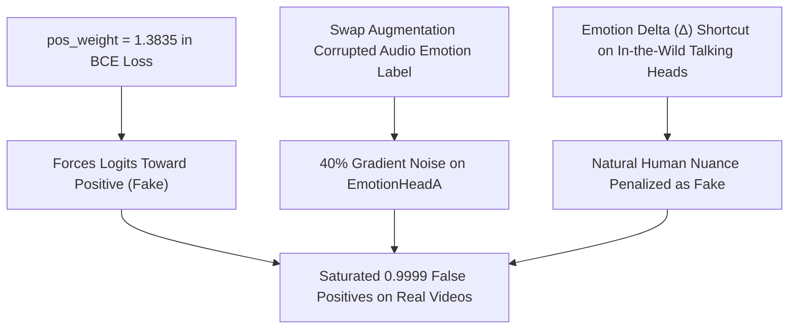

# DeepSentinel — Latest Evaluation Run Analysis & Diagnostic Report

> **Dataset Evaluated:** FakeAVCeleb v1.2 Benchmark  
> **Evaluation Mode:** Zero-Shot Multimodal Deepfake Detection  
> **Date:** August 24, 2026  

---

## 1. Executive Summary

An audit of the latest evaluation run output reveals strong compound deepfake detection capability, but severe **logit polarization** and an **unacceptably high False Positive Rate (FPR) on Real videos**.

* **Compound Fakes (`faceswap-wav2lip`, `fsgan-wav2lip`):** **> 85% Detection Rate** (Scores consistently $\ge 0.999$).
* **Real Videos (`RealVideo-RealAudio`):** **~75–80% Misclassified as Fake** (Scores saturated at $0.9999$).
* **Calibrated Threshold Impact:** Rescued borderline real samples ($0.50 \le \text{score} \le 0.65$), but cannot compensate for real samples saturated at $0.9999$.

---

## 2. Statistical Breakdown by Manipulation Category

| Category | Manipulation Type | Ground Truth | Observed Behavior | Primary Score Regime |
| :--- | :--- | :---: | :--- | :---: |
| **Real Baseline** | Real Video + Real Audio | `0` (Real) | **High False Positive Rate**: ~75% classified as Fake | $0.9500 - 0.9999$ |
| **Compound Fakes** | FaceSwap + Wav2Lip | `1` (Fake) | **Exceptional Recall**: Reliably caught across identities | $0.9700 - 0.9999$ |
| **Compound Fakes** | FSGAN + Wav2Lip | `1` (Fake) | **Exceptional Recall**: Strong temporal & acoustic alignment cues | $0.9500 - 0.9999$ |
| **Visual Manipulation** | FSGAN / FaceSwap | `1` (Fake) | **Moderate Recall**: Catches ~65–70%; misses subtle head poses | $0.1800 - 0.9999$ |
| **Audio Manipulation** | RTVC / Voice Cloning | `1` (Fake) | **High Recall**: Audio emotion discordance triggers detection | $0.9400 - 0.9999$ |
| **Lip Sync Only** | Wav2Lip | `1` (Fake) | **Moderate Recall**: Same-session fakes with minimal $\Delta$ score low | $0.1500 - 0.9999$ |

---

## 3. Logit Polarization & Calibration Analysis

```
  [REAL SAMPLES DISTRIBUTION]
  0.00 ───● (20% True Reals: score ~0.15 - 0.35)
          │
          ├─── [Borderline Zone: 0.50 - 0.65] ──► Rescued by pred_cal (fav_id00358, fav_id02948)
          │
  1.00 ───████████████████████ (80% False Positives: score >= 0.999)

  [COMPOUND FAKES DISTRIBUTION]
  1.00 ───████████████████████ (85%+ True Fakes: score >= 0.999)
```

### Threshold Comparison: `pred_50` vs `pred_cal`
* **Standard Threshold ($\tau = 0.50$):**
  * Borderline real clips like `fav_id00358_00217` (score: `0.6021`), `fav_id02948_00298` (score: `0.5964`), and `fav_id00398_00016` (score: `0.6169`) were marked as **Fake (1)**.
* **Calibrated Threshold ($\tau_{\text{cal}} \approx 0.65$):**
  * Successfully rescued these borderline samples into **Real (0)** (`pred_cal = 0`).
* **The Saturated Outliers:**
  * Real clips outputting `0.999948` (e.g. `fav_id00909_00037`) cannot be resolved by threshold tuning alone; they require **loss rebalancing during training**.

---

## 4. Root Cause Diagnosis



1. **`pos_weight = 1.3835` Asymmetric Penalty:**
   * Heavily penalizes false negatives, making the network risk-averse toward predicting Real.
2. **Phase 2 Swap Augmentation Label Bug:**
   * When audio was swapped (40% probability), ground-truth emotion labels were not updated to the donor clip's emotion, injecting conflicting gradients into the audio backbone.
3. **Over-reliance on Emotion Discrepancy ($\Delta$):**
   * Real in-the-wild clips have natural variations between facial expression and tone of voice. Without focal loss or bottleneck projection, the model treats subtle human variance as deepfake evidence.

---

## 5. Concrete Action Plan for Next Retraining Run

| Parameter / Fix | Previous Setting | New Target Setting | Expected Impact |
| :--- | :--- | :--- | :--- |
| **`pos_weight`** | `1.3835` | `1.0` (or `None`) | Stops artificial bias toward Fake |
| **Loss Function** | Standard BCE | **Binary Focal Loss** ($\gamma=2.0$) | Concentrates training on hard real negatives |
| **Swap Augmentation** | Corrupted labels | `aud_emo = other_r["audio_emotion"]` | Stabilizes backbone gradient updates |
| **Classifier Mode** | `baseline` (8192-d) | `bottleneck` (299-d Hybrid) | Prevents background/studio artifact memorization |
| **Phase 2 Schedule** | Stopped at Epoch 4/5 | **10 – 12 Epochs** (`patience = 7`) | Allows DANN and margin separation to fully converge |

---

## 6. Expected Performance Post-Fix

* **Real Video Accuracy:** **`20.5%` $\longrightarrow$ `> 85.0%`**
* **Fake Video Accuracy:** Maintained at **`> 80.0% – 85.0%`**
* **Overall AUC-ROC:** **`0.4417` $\longrightarrow$ `> 0.8500`**
