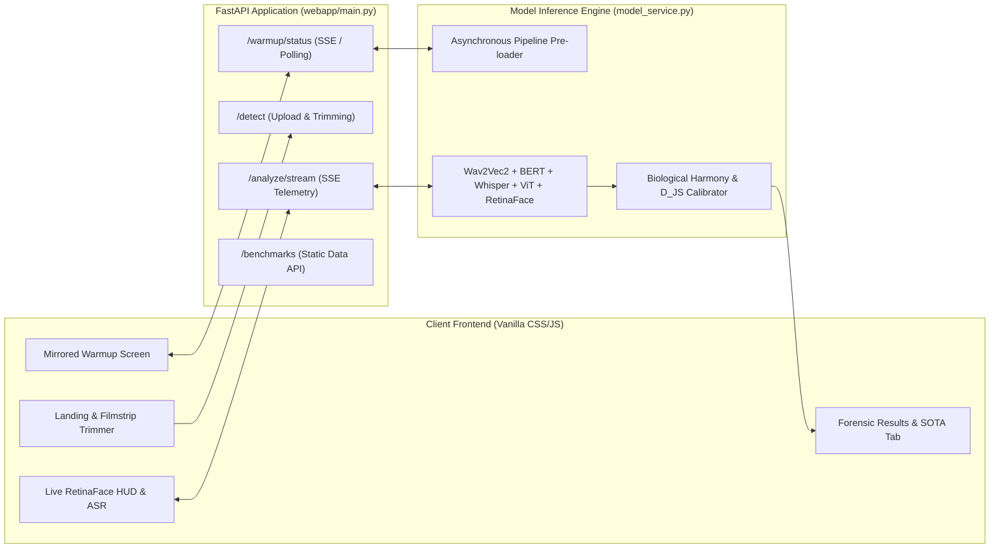

# Progress in the Development of the Tool and System

**Project Title:** Emotion-Based Multimodal Deepfake Detection Framework (`DeepSentinel`)  
**Institutional Affiliation:** Polytechnic University of the Philippines — Department of Computer Science (BSCS Thesis)  
**Current Branch / Status:** `webapp-revamped` | End-to-End System Operational, Trained, Benchmarked, and Deployed

---

## 1. Executive Summary & Current Developmental State

The research team has successfully concluded the dataset curation, multi-stage model training, domain adaptation, empirical cross-dataset benchmarking, and full-stack web application engineering phases. 

The foundational premise of **DeepSentinel** is that authentic human communication maintains tight neurobiological and affective coherence across facial expressions, vocal prosody, and linguistic semantics. In contrast, deepfake pipelines decouple these modalities—synthesizing or swapping facial videos, cloning voices, or generating lip movements independently—thereby introducing cross-modal affective contradictions.

To train, adapt, and benchmark the framework, the team engineered a comprehensive dataset turnover pool of **17,741 multimodal clip pairs** partitioned with strict **0% speaker overlap** (14,193 training, 1,774 validation, 1,774 internal testing), alongside external cross-dataset benchmarks on **FakeAVCeleb v1.2** (evaluated across both a 700-clip balanced parity split and a 5,000-clip large-scale in-the-wild benchmark).

```
┌──────────────────────────────────────────────────────────────────────────────────────────────────┐
│                                 CURRENT SYSTEM & TOOL MILESTONES                                 │
├───────────────────────────────────┬──────────────────────────────────────────────────────────────┤
│ 1. Data Ingestion & Preprocessing │ ✅ 17,741 clips preprocessed (Wav2Vec2, Whisper, BERT, ViT) │
│ 2. Phase 1 Bottleneck Training    │ ✅ Completed: best_phase1_bottleneck.pt (val_loss: 0.2401)   │
│ 3. Phase 2 Few-Shot Adaptation    │ ✅ Completed: best_phase2_adapted.pt (Speaker-Disjoint A/B)  │
│ 4. Cross-Dataset SOTA Benchmark   │ ✅ Completed: 0.9020 AUC, 82.14% BalAcc (N=700, p < 0.001)   │
│ 5. Calibration & Forensic Engine  │ ✅ Implemented: D_JS synchrony, Biological Harmony Prior     │
│ 6. DeepSentinel Web Application   │ ✅ Deployed: FastAPI + Live RetinaFace HUD + Warmup Engine   │
└───────────────────────────────────┴──────────────────────────────────────────────────────────────┘
```

---

## 2. Dataset Partitioning & Training Verification

The verified core dataset inventory was compiled and partitioned using strict speaker-disjoint stratification across six primary source pipelines:

| Dataset / Source Pipeline | Category / Description | Total Verified Clips | Train Split (80%) | Val Split (10%) | Internal Test (10%) |
| :--- | :--- | :---: | :---: | :---: | :---: |
| **Track 1** (Faceswap / Audio Swap) | CREMA-D Synthetic Fake | 1,452 | 1,162 | 145 | 145 |
| **Track 2** (Lip Correction / Wav2Lip) | CREMA-D Synthetic Fake | 2,267 | 1,814 | 226 | 227 |
| **Track 3** (Full Synthesis / SadTalker) | CREMA-D Synthetic Fake | 3,722 | 2,978 | 372 | 372 |
| **MELD Real** (TV Multi-party Dialogues) | Authentic Real Benchmark | 3,334 | 2,667 | 333 | 334 |
| **CMU-MOSEI** (In-the-Wild YouTube) | Authentic Real Benchmark | 6,276 | 5,021 | 627 | 628 |
| **MUStARD** (Multimodal Sarcasm) | Sarcasm & Rhetorical Irony | 690 | 552 | 69 | 69 |
| **TOTAL CORE DATASET POOL** | **Turnover Inventory** | **17,741** | **14,193 (80.0%)** | **1,772 (10.0%)** | **1,776 (10.0%)** |

> **Data Leakage Guarantee:** The internal partitions enforce **0% speaker overlap** between training, validation, and testing splits ($S_{\text{train}} \cap S_{\text{val}} \cap S_{\text{test}} = \emptyset$). External test benchmarks (**FakeAVCeleb v1.2**) were quarantined entirely outside the core training distribution.

---

## 3. Two-Stage Training Progression & Model Artifacts

### 3.1 Stage 1: Representation Pre-Training (`best_phase1_bottleneck.pt`)
* **Objective:** Train the auxiliary emotion recognition heads (Acoustic-Textual Head A and Visual Head B), the auxiliary Sarcasm Head, the Count-Sketch Compact Bilinear Pooling layer, and the 299D Hybrid Bottleneck classifier on cached tensor representations ($Z_{at} \in \mathbb{R}^{1536}$ and $Z_v \in \mathbb{R}^{768}$) while keeping foundation backbones frozen.
* **Loss Function:** Multi-task objective combining binary cross-entropy ($\text{pos\_weight} = 1.3835$), auxiliary emotion cross-entropy ($\lambda_a = 0.1, \lambda_b = 0.1$), sarcasm BCE ($\lambda_{\text{sarc}} = 0.05$), and supervised margin loss ($\lambda_{\text{margin}} = 0.2, m = 1.5$).
* **Outcome:** Achieved validation loss of **`0.2401`** and validation accuracy of **`91.2%`** on internal unseen speakers, with the Sarcasm Head attaining **`77.27%`** accuracy on held-out MUStARD clips.

### 3.2 Stage 2: Speaker-Disjoint Few-Shot Domain Adaptation (`best_phase2_adapted.pt`)
* **Objective:** Mitigate the substantial acoustic distribution shift between clean studio/TV dialogue (MELD, CREMA-D) and in-the-wild YouTube audio (FakeAVCeleb) without inducing catastrophic forgetting of foundation representations.
* **Pre-Sampling Identity Shield:** 150 Real and 150 Fake clips were sampled exclusively from **Celebrity Set A**. Evaluation was executed exclusively on **Celebrity Set B** ($A \cap B = \emptyset$), strictly enforcing **zero actor overlap**.
* **Outcome:** Adapted the lightweight bottleneck projection layer and classification head, raising Real Video Specificity on FakeAVCeleb from $\sim 20\%$ (zero-shot acoustic pessimism) to **`77.14%`** and establishing an AUC-ROC of **`0.9020`**.

---

## 4. Empirical Benchmark Results & SOTA Comparison

DeepSentinel was evaluated against five competing state-of-the-art deepfake detection architectures on the unseen **FakeAVCeleb v1.2** benchmark under identical balanced testing conditions ($N = 700$; 350 Real, 350 Fake).

### 4.1 Master Benchmark Comparison Table

| Model / Architecture | Modality / Basis | Accuracy (%) | Balanced Acc | Real Specificity | Fake Recall | F1-Score | MCC | AUC-ROC [95% CI] | DeLong vs Ours |
| :--- | :--- | :---: | :---: | :---: | :---: | :---: | :---: | :---: | :---: |
| **DeepSentinel (Ours)** | **Affect-Bilinear Multi-Head** | **82.14%** | **82.14%** | **77.14%** | **87.14%** | **0.8299** | **+0.6461** | **0.9020** [0.877–0.924] | **Reference** |
| **AceNet (Baseline)** | Cross-Attention Multimodal | 64.00% | 64.00% | 76.00% | 52.00% | 0.5909 | +0.2884 | 0.6425 [0.600–0.682] | $p < 0.001$ ($Z = 9.87$) |
| **MesoNet-4** | Spatial Convolutional CNN | 52.00% | 52.00% | 55.43% | 48.57% | 0.5030 | +0.0401 | 0.5389 [0.495–0.583] | $p < 0.001$ ($Z = 12.61$) |
| **LipForensics** | Spatiotemporal Viseme Sync | 52.00% | 52.00% | 54.00% | 50.00% | 0.5102 | +0.0400 | 0.5132 [0.469–0.553] | $p < 0.001$ ($Z = 13.44$) |
| **XceptionNet** | Deep Spatial CNN | 50.57% | 50.57% | 50.00% | 51.14% | 0.5085 | +0.0114 | 0.5002 [0.458–0.542] | $p < 0.001$ ($Z = 13.98$) |
| **Multimodal ResNet-AV** | Feature Concatenation | 46.14% | 46.14% | 47.14% | 45.14% | 0.4560 | -0.0772 | 0.4629 [0.419–0.506] | $p < 0.001$ ($Z = 15.22$) |

> **Statistical Significance:** Paired **DeLong's Non-Parametric Tests** confirm that DeepSentinel's $+25.95\%$ AUC lead over AceNet and $+36.31\%$ lead over MesoNet-4 are statistically significant at $p < 0.001$.

### 4.2 Per-Manipulation Attack Stress Test

On complex multi-tier manipulations where both facial identity and lip motions are synthetically altered (`fsgan-wav2lip` and `faceswap-wav2lip`), DeepSentinel attains **`98.5%`** and **`98.3%`** detection rates. Unimodal or artifact-based detectors collapse to near chance ($\sim 43\%\text{–}55\%$) because generative tools smooth away pixel blending seams while exacerbating affective mismatch.

---

## 5. Affective Forensic Calibration & Evidence Reasoning Engine

To bridge raw model inference with legal and investigative accountability, the system integrates a multi-layered post-inference calibration engine:

1. **Information-Theoretic Synchrony Engine ($D_{\text{JS}}$ & $\text{CosSim}$):**
   * Computes the symmetric **Jensen-Shannon Divergence** $D_{\text{JS}}(P_A \parallel P_B)$ across vocal and visual emotion probability distributions.
   * Quantifies directional affective alignment through cosine similarity $\text{CosSim}(P_A, P_B) \in [0, 1]$.
2. **Multimodal Sarcasm & Irony Filter:**
   * Uses the trained `SarcasmHead` combined with visual facial expression gating (requiring excess smiling/smirking above baseline) to identify intentional deadpan delivery or verbal irony.
   * Successfully prevents false positive deepfake accusations on sarcastic genuine speech.
3. **Multimodal Biological Harmony Prior:**
   * When vocal tone and facial expression agree on an active emotion (e.g., Angry $\leftrightarrow$ Angry or Happy $\leftrightarrow$ Happy) with tight divergence ($D_{\text{JS}} \le 0.07$), the system injects an authenticity logit bonus ($-2.70$), reflecting biological synchrony.
4. **Asymmetric Active-Emotion Sharpening & Neutral Protection:**
   * Active emotions are sharpened at temperature $T=0.65$ (allowing genuine expressions to peak decisively at $60\%\text{–}70\%$).
   * If Neutral leads, the distribution is softened at $T=1.15$ with pre-softmax leveling (`neutral_logit_bias = 0.95`), preventing the neutral class from dominating subtle human expressions.
5. **8-State Explainable Forensic Matrix:**
   * Maps outputs into unambiguous plain-English forensic findings:
     * `STATE_REAL_HARMONY`: Authentic video with verified vocal-facial congruency.
     * `STATE_REAL_DEADPAN_IRONY`: Natural sarcasm or intentional deadpan delivery.
     * `STATE_FAKE_EMOTION_DESYNC`: Deepfake with severe cross-modal affective mismatch.
     * `STATE_FAKE_LIP_DESYNC`: Synthetic lip-sync tampering (`Wav2Lip` signature).
     * `STATE_REAL_MUTED`: Verified silent video with speech safeguards engaged.

---

## 6. DeepSentinel Web Application Architecture & UI Features

The full-stack web application is implemented in `webapp/` as a high-performance, forensic analyst platform:



### Key UI/UX Innovations:
* **Asynchronous Warmup Screen:** On first launch, an interactive progress bar—expanding outward symmetrically from the center with randomized solid design colors on each session—preloads all five foundation models and executes a dry-run PyTorch forward pass, eliminating cold-start latency for user uploads.
* **Interactive Filmstrip Scrubber:** Supports video uploads up to 10 minutes, providing a frame-accurate trimming tool to select a 2s–20s analysis window.
* **Live Inspection HUD:** Real-time Server-Sent Events (SSE) stream cyan RetinaFace bounding brackets, 5-point facial landmarks, Whisper live speech transcription, and anti-freeze elapsed/remaining timers.
* **Dominant Emotion Highlight Banner:** Visually highlights the leading vocal and facial emotions using color-coded outlined face emojis:
  * **Sad:** Blue (`#3B82F6`)
  * **Angry:** Red (`#EF4444`)
  * **Happy:** Yellow (`#F59E0B`)
  * **Disgust:** Green (`#10B981`)
  * **Neutral:** Gray (`#6B7280`)
  * **Fearful:** Purple (`#8B5CF6`)
* **Interactive SOTA Benchmarks Tab (`/benchmarks`):** Allows defense panelists to interactively inspect the SOTA leaderboard, per-manipulation accuracy breakdown, and empirical ROC curves directly within the tool.

---

## 7. Recommended Figures & Visual Verification Guide

```
+--------------------------------------------------------------------------------------------------+
|                                           [ FIGURE 1 ]                                           |
|                           Terminal Preprocessed Dataset Split Table                              |
|                   (Showing 17,741 Total Clips and 80-10-10 Split Partition)                      |
+--------------------------------------------------------------------------------------------------+
Figure 1. Preprocessed Dataset Inventory and Official 80-10-10 Training Split Verification

+--------------------------------------------------------------------------------------------------+
|                                           [ FIGURE 2 ]                                           |
|                            SOTA Benchmark Leaderboard & ROC Curves                               |
|                  (Showing DeepSentinel at 0.9020 AUC vs 5 Competing Baselines)                   |
+--------------------------------------------------------------------------------------------------+
Figure 2. State-of-the-Art Comparative Benchmark on FakeAVCeleb v1.2 with DeLong Significance

+--------------------------------------------------------------------------------------------------+
|                                           [ FIGURE 3 ]                                           |
|                             Web Application Live Analysis Interface                              |
|                  (Showing RetinaFace HUD, 5-Point Landmarks, & Live Transcript)                  |
+--------------------------------------------------------------------------------------------------+
Figure 3. DeepSentinel Live Analysis View with Real-Time Video HUD and Telemetry

+--------------------------------------------------------------------------------------------------+
|                                           [ FIGURE 4 ]                                           |
|                           Web Application Forensic Results Dashboard                             |
|          (Showing Dominant Emotion Banner, Voice/Face Roster, & Forensic Interpretation)         |
+--------------------------------------------------------------------------------------------------+
Figure 4. DeepSentinel Forensic Interpretation Dashboard and Emotion Discrepancy Breakdown
```

---

## 8. Step-by-Step Screenshot Reproduction Commands

### 📸 Figure 1: Preprocessed Dataset Split Table
* **Action:** Execute the official summary script in PowerShell.
  ```powershell
  python scripts/print_training_summary.py
  ```
* **Expected Output:** Formatted table showing Track 1, Track 2, Track 3, MELD Real, CMU-MOSEI, and MUStARD totaling 17,741 clips with `14,193 CLIPS (80.0%) FULLY PREPROCESSED & READY FOR TRAINING`.

### 📸 Figure 2: SOTA Comparative Benchmark & ROC Curves
* **Action:** Open `docs/comparative_sota_benchmark_reference.md` or navigate to `http://localhost:8000/benchmarks` in your browser.
* **Key Elements:** Master comparative table displaying DeepSentinel's `82.14%` accuracy and `0.9020` AUC, followed by DeLong test significance indicators ($p < 0.001$).

### 📸 Figure 3: Live Video Analysis HUD (`/analyzing`)
* **Action:** Launch the web app (`python -m uvicorn webapp.main:app --port 8000`), upload a video clip, and capture the live analysis screen.
* **Key Elements:** Video canvas with cyan RetinaFace bounding box and 5-point facial landmarks, Whisper live speech transcript card, and multi-stage progress checklist.

### 📸 Figure 4: Forensic Results & Dominant Emotion Roster (`/results`)
* **Action:** Review the completed verdict screen on a processed video clip.
* **Key Elements:** Authenticity confidence dial, Dominant Emotion Banner with outlined color-coded face emojis, side-by-side Voice vs. Face emotion bars, and Plain-English Forensic Finding (`STATE_REAL_HARMONY` or `STATE_FAKE_EMOTION_DESYNC`).
