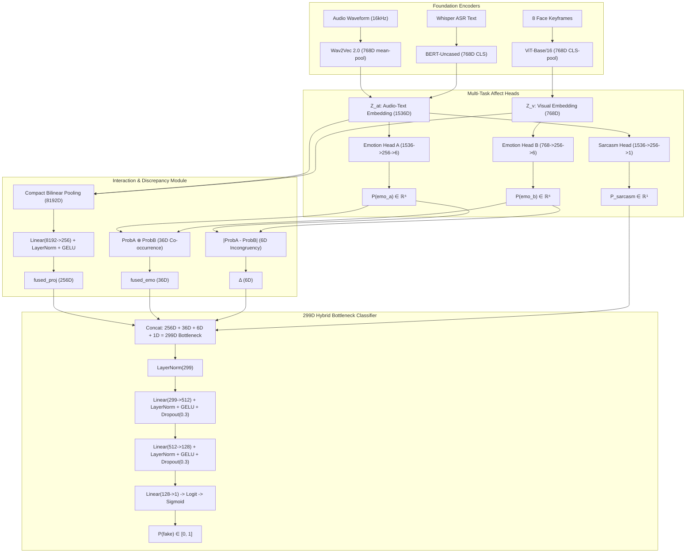

# DeepSentinel — Master Project Context Document

> **Purpose of this file:** This is the single, authoritative, exhaustive, and mathematically complete brain-dump of the entire **DeepSentinel** thesis project: its theoretical foundations, research questions, complete neural architecture, dataset curation, generation pipelines, recent failure post-mortems, the 5-point calibration fixes, multi-model AI peer review consensus, and the active production deployment workflow.
>
> **Hand-off Guarantee:** Any AI assistant on any teammate's account or human reviewer can read this file and possess **100% of the institutional memory, architectural invariants, empirical history, and operational rules** of the project.
>
> **Last Fully Reconciled Against Codebase & Training Runs:** 2026-08-16 (Commit `e96b315`, Branch `feat/training-turnover-prep`).
>
> **Primary References:**
> - [docs/architecture_decision_report.md](file:///d:/Documents/Programming/Thesis_G10/docs/architecture_decision_report.md) — Exhaustive development logs & Section 10 Post-Mortem.
> - [docs/multi_model_evaluation_postmortem.md](file:///d:/Documents/Programming/Thesis_G10/docs/multi_model_evaluation_postmortem.md) — 3-Way AI Peer Review Synthesis (DeepSeek-R1, Claude Opus 4.6, Antigravity) with 21 academic references.
> - [docs/antigravity_review.md](file:///d:/Documents/Programming/Thesis_G10/docs/antigravity_review.md) — Deep-dive mathematical & calibration review.

---

## Table of Contents

1. [30-Second Snapshot & System Metadata](#1-30-second-snapshot--system-metadata)
2. [The Thesis: Theoretical Grounding & Core Hypothesis](#2-the-thesis-theoretical-grounding--core-hypothesis)
3. [Research Questions & Hypotheses](#3-research-questions--hypotheses)
4. [Manuscript Analysis & Alignment (Chapters 1–3)](#4-manuscript-analysis--alignment-chapters-13)
5. [Complete Neural Architecture (The 299D Hybrid Bottleneck)](#5-complete-neural-architecture-the-299d-hybrid-bottleneck)
6. [The Sarcasm Head — Acoustic-Semantic Incongruency Resolving](#6-the-sarcasm-head--acoustic-semantic-incongruency-resolving)
7. [Multi-Task Loss Formulation & Supervised Margin Loss](#7-multi-task-loss-formulation--supervised-margin-loss)
8. [Two-Phase Training Curriculum](#8-two-phase-training-curriculum)
9. [Dataset Engineering & 80/10/10 Speaker-Stratified Splits](#9-dataset-engineering--801010-speaker-stratified-splits)
10. [Deepfake Generation Pipelines (Tracks 1–4)](#10-deepfake-generation-pipelines-tracks-14)
11. [Preprocessing Pipeline & AU Saliency](#11-preprocessing-pipeline--au-saliency)
12. [Failure Mode Post-Mortem & The 5 Persisting Bugs Resolved](#12-failure-mode-post-mortem--the-5-persisting-bugs-resolved)
13. [Multi-Model Peer Review Consensus (DeepSeek, Claude, Antigravity)](#13-multi-model-peer-review-consensus-deepseek-claude-antigravity)
14. [Evaluation & Threshold Calibration Framework](#14-evaluation--threshold-calibration-framework)
15. [Current Verification State & Empirical Benchmarks](#15-current-verification-state--empirical-benchmarks)
16. [Significance Testing Framework (Battle of the Frameworks vs ACE-Net)](#16-significance-testing-framework-battle-of-the-frameworks-vs-ace-net)
17. [Google Colab Workflow (4-Cell Production Runner)](#17-google-colab-workflow-4-cell-production-runner)
18. [Web Application & Interactive Demo UI](#18-web-application--interactive-demo-ui)
19. [Repository Map & File-by-File Guide](#19-repository-map--file-by-file-guide)
20. [Global System Mindset & Operational Invariants](#20-global-system-mindset--operational-invariants)

---

## 1. 30-Second Snapshot & System Metadata

**DeepSentinel** is a Bachelor of Science in Computer Science (BSCS) undergraduate thesis project at the **Polytechnic University of the Philippines** (Manila, graduating May 2026).

* **Authors / Researchers:**
  * Cabral, Shikina Y.
  * Caparas, John Christian B.
  * Exconde, Matan John B.
  * Rivera, Geuel John D.
* **Official Thesis Title:** *A Multimodal Deepfake Detection Framework Leveraging Bilinear Pooling and Emotion Mismatch.*
* **Core Idea in 3 Sentences:** Standard deepfake detectors search for visual synthesis artifacts (blending boundaries, warping glitches), which rapidly disappear as generative models advance. DeepSentinel shifts the detection paradigm to **affective/behavioral incongruency**: deepfake generators synthesize audio and facial motion independently, breaking the natural emotional coordination between what a person says (semantics), how they say it (prosody/acoustics), and how their face moves (visual expression). DeepSentinel detects deepfakes by extracting multi-modal affect representations, measuring cross-modal emotional divergence ($\boldsymbol{\Delta}$), and fusing features via Compact Bilinear Pooling with a 299D multi-scale hybrid bottleneck.

```
┌────────────────────────────────────────────────────────────────────────────────────────┐
│                                 CURRENT SYSTEM STATUS                                  │
├─────────────────────────────────┬──────────────────────────────────────────────────────┤
│ Codebase State                  │ ✅ Fully Implemented, Unit-Tested & Calibrated       │
│ Git Branch & Commit             │ ✅ feat/training-turnover-prep (Commit: e96b315)       │
│ Dataset Manifests               │ ✅ 17,741 clips (80/10/10 0% speaker overlap)        │
│ Feature Cache (z_at, z_v)       │ ✅ 20,178 valid tensor pairs extracted               │
│ Stage 1 Checkpoint              │ ✅ best_phase1_bottleneck.pt (val_loss=0.2306)       │
│ Stage 2 Fine-Tuning             │ ✅ Live E2E Val + Top-4 Layers + Margin Loss (m=1.5) │
│ Stage 2 Live Epoch 1 Result     │ ✅ val_acc=90.80%, emo_a=37.96%, emo_b=38.73%       │
│ FakeAVCeleb Benchmark Harness   │ ✅ Balanced 500/500 + Youden's J + MCC + Zero-FP     │
│ Google Drive Auto-Sync          │ ✅ Multi-location sync + os.sync() buffer flushing   │
└─────────────────────────────────┴──────────────────────────────────────────────────────┘
```

---

## 2. The Thesis: Theoretical Grounding & Core Hypothesis

### 2.1 The Vulnerability of Artifact-Based Detection
Existing deepfake detectors predominantly rely on low-level convolutional or frequency-domain artifact detection (e.g. boundary artifacts, blending seams, Fourier spectrum abnormalities). As generative models transition to high-resolution diffusion transformers (e.g., Stable Video Diffusion, EMO, MuseTalk), visual artifacts diminish exponentially, causing artifact-based detectors to suffer catastrophic cross-dataset degradation (frequently falling to $50\text{–}60\%$ AUC).

### 2.2 The Behavioral / Affective Alternative
DeepSentinel shifts the fundamental detection basis from *pixel quality* to **multimodal behavioral authenticity**.
* **Ekman & Friesen (1969) / Mehrabian (1971):** Spontaneous human communication exhibits tight cross-modal emotional congruency. When genuine speakers express anger, happiness, or fear, acoustic prosody (pitch variance, energy), lexical sentiment (word choice), and facial Action Units (AUs) activate synchronously.
* **The Asynchrony Flaw in Generative Models:** Deepfake pipelines synthesize visual motion and audio tracks as separate decoupled stages (e.g., swapping a face with FSGAN while splicing cloned audio with RTVC, or driving neutral facial video with expressive Wav2Lip speech). This structural disconnect produces high-level affective incoherence.

### 2.3 Three Theoretical Pillars
1. **Multimodal Emotion Recognition & Representation Learning:** Leveraging self-supervised foundation transformers — Wav2Vec 2.0 (Acoustic Prosody), BERT-Uncased (Linguistic Semantics), and ViT-Base/16 (Facial Action Unit Keyframes) — as frozen and fine-tuned feature extractors.
2. **Deepfake Incongruency Modeling:** Explicitly quantifying affective discrepancy through per-emotion absolute delta vectors ($\boldsymbol{\Delta}$) and co-occurrence correlation matrices ($\mathbf{fused\_emo}$).
3. **Multimodal Fusion via Bilinear Modeling:** Employing Compact Bilinear Pooling (CBP) with Count Sketch and FFT to capture multiplicative, quadratic cross-modal interactions rather than simplistic linear concatenation.

---

## 3. Research Questions & Hypotheses

* **RQ1 (Acoustic-Textual Affect Accuracy):** What is the model's speech-text emotion recognition accuracy on CREMA-D when evaluated through Emotion Head A?
* **RQ2 (Visual Facial Affect Accuracy):** What is the model's visual-only facial expression recognition accuracy on CREMA-D when evaluated through Emotion Head B?
* **RQ3 (Zero-Shot Cross-Dataset Generalization):** What is the full DeepSentinel framework's deepfake detection performance (AUC-ROC, Balanced Accuracy, Specificity, Sensitivity, MCC) on the unseen FakeAVCeleb v1.2 benchmark?
* **RQ4 (Sarcasm Disambiguation & Specificity Protection):** To what extent can the auxiliary Sarcasm Head distinguish natural sarcasm-induced cross-modal mismatch from malicious deepfake manipulation on MUStARD?
* **Hypothesis (H1 - Battle of the Frameworks):** DeepSentinel achieves a statistically significant improvement in AUC performance over **ACE-Net** (Yu et al., 2025; state-of-the-art multimodal deepfake detector) on FakeAVCeleb v1.2, evaluated via DeLong's test ($p < 0.05$).

---

## 4. Manuscript Analysis & Alignment (Chapters 1–3)

### 4.1 Key Manuscript Alignments:
* **Chapter 1 (Introduction & Problem Statement):** Grounds the motivation in generative AI proliferation and establishes the gap between artifact detection and high-level behavioral detection.
* **Chapter 2 (Review of Related Literature & Theoretical Framework):**
  * Surveys baseline architectures: MesoNet (Afchar et al., 2018), Xception (Chollet, 2017), FaceForensics++ (Rossler et al., 2019), and multimodal architectures like MDS (Chugh et al., 2020) and ACE-Net (Yu et al., 2025).
  * Outlines the mathematical principles of Count Sketch Compact Bilinear Pooling (Gao et al., 2016; Fukui et al., 2016).
* **Chapter 3 (Methodology & Experimental Architecture):**
  * Details the 80/10/10 speaker-stratified dataset partition.
  * Specifies the 299D multi-scale hybrid bottleneck fusion.
  * Formulates the multi-task loss with Supervised Contrastive Margin Loss.
  * Specifies statistical validation protocols (DeLong's test, Bootstrap 95% Confidence Intervals).

### 4.2 Panel Defense Invariants & Review Directives:
* **Why not simple concatenation?** Concatenation ($\mathbb{R}^{1536 + 768}$) treats features as independent linear channels. CBP models pairwise quadratic interactions ($1536 \times 768 = 1,179,648\text{D}$) where subtle cross-modal asynchronies reside.
* **Why 6 discrete emotions?** Aligned with Paul Ekman's universal basic emotions: Neutral, Happy, Sad, Angry, Fear, Disgust.
* **Why is Sarcasm auxiliary?** Sarcasm is a natural mismatch. By feeding $P_{\text{sarcasm}}$ directly into the final classifier alongside $\boldsymbol{\Delta}$, the classifier learns to suppress false manipulation alarms on sarcastic genuine speech.

---

## 5. Complete Neural Architecture (The 299D Hybrid Bottleneck)

DeepSentinel takes a single video clip and outputs a calibrated manipulation probability $P(\text{fake}) \in [0, 1]$.



### 5.1 Mathematical Decomposition of the 299D Bottleneck:
$$\mathbf{x}_{\text{classifier}} = \text{Concat}\Big(\underbrace{\mathbf{fused\_proj}}_{256D},\ \underbrace{\mathbf{fused\_emo}}_{36D},\ \underbrace{\boldsymbol{\Delta}}_{6D},\ \underbrace{P_{\text{sarcasm}}}_{1D}\Big) \in \mathbb{R}^{299}$$

1. **`fused_proj` (256D):** Sub-symbolic bilinear interaction. CBP compresses the $1536 \times 768 = 1,179,648\text{D}$ outer product to 8192D via Count Sketch FFT, normalized by signed-sqrt and L2-norm, then projected through `Linear(8192, 256) + LayerNorm + GELU`.
2. **`fused_emo` (36D):** Joint affective state matrix $\text{softmax}(\hat{y}_a) \otimes \text{softmax}(\hat{y}_b) \in \mathbb{R}^{6 \times 6}$. Captures specific cross-modal emotion combinations (e.g. Angry Voice + Smiling Face).
3. **$\boldsymbol{\Delta}$ (6D):** Absolute per-emotion probability delta $|\text{softmax}(\hat{y}_a) - \text{softmax}(\hat{y}_b)|$. The primary symbolic mismatch indicator.
4. **$P_{\text{sarcasm}}$ (1D):** Scalar probability of acoustic-semantic sarcasm, disambiguating natural sarcasm from malicious manipulation.

### 5.2 LayerNorm Classifier Stabilization
The classifier MLP uses intermediate `nn.LayerNorm` layers to strictly bound activations and eliminate gradient explosion:
* Input: $\mathbf{x} \in \mathbb{R}^{299}$
* Layer 1: `LayerNorm(299) -> Linear(299, 512) -> LayerNorm(512) -> GELU -> Dropout(0.3)`
* Layer 2: `Linear(512, 128) -> LayerNorm(128) -> GELU -> Dropout(0.3)`
* Output: `Linear(128, 1)` (produces raw logit $z \in \mathbb{R}$, converted via sigmoid to $P(\text{fake})$).

---

## 6. The Sarcasm Head — Acoustic-Semantic Incongruency Resolving

### 6.1 Defense Against False Alarms
Natural human conversations frequently contain cross-modal mismatches (e.g., deadpan delivery, sarcastic praise). Without treatment, an affect-mismatch detector would falsely classify sarcastic individuals as deepfakes.

### 6.2 Architecture & Supervision
* **Architecture:** `Linear(1536, 256) -> GELU -> Dropout(0.3) -> Linear(256, 1)`. Operates on $Z_{\text{at}}$ (Audio + Text).
* **Supervision:** Trained on MUStARD ($N=690$ clips). All other datasets have `sarcasm_label = -1` and are cleanly masked out during loss calculation.
* **Empirical Verification:** Reached **$77.27\%$ validation accuracy** on unseen MUStARD speakers (vs $50\%$ random chance), proving strong acoustic-textual sarcasm feature learning.

---

## 7. Multi-Task Loss Formulation & Supervised Margin Loss

The total training objective balances primary binary manipulation detection, auxiliary affect classification, and explicit inter-class logit separation:

$$\mathcal{L}_{\text{total}} = \mathcal{L}_{\text{BCE}}(\hat{y}, y;\ \text{pos\_weight}=1.3835) + \lambda_a \mathcal{L}_{\text{CE}}^{(\text{emo\_a})} + \lambda_b \mathcal{L}_{\text{CE}}^{(\text{emo\_b})} + \lambda_{\text{sarc}} \mathcal{L}_{\text{BCE}}^{(\text{sarc})} + \lambda_{\text{margin}} \mathcal{L}_{\text{margin}}$$

### Loss Hyperparameters & Exact Derivations:
* **$\text{pos\_weight} = 1.3835$:** Exact training class balance ratio ($N_{\text{real}} / N_{\text{fake}} = 8254 / 5966$). Compensates for dataset class prevalence.
* **$\lambda_a = 0.1, \lambda_b = 0.1, \lambda_{\text{sarc}} = 0.05$:** Concentrates 90%+ gradient mass on binary detection while maintaining active supervision on auxiliary affect heads.
* **$\lambda_{\text{margin}} = 0.2$ with Margin $m = 1.5$:**
  $$\mathcal{L}_{\text{margin}} = \max\left(0,\ 1.5 - (\bar{s}_{\text{fake}} - \bar{s}_{\text{real}})\right)$$
  Directly penalizes the network whenever the distance between batch fake logit mean and real logit mean is less than 1.5, actively preventing score compression.

---

## 8. Two-Phase Training Curriculum

```
┌─────────────────────────────────────────────────────────────────────────────────────────────┐
│                                 TWO-PHASE TRAINING SCHEDULE                                 │
├─────────────────────────────────────────────────────────────────────────────────────────────┤
│ Phase 1: Frozen Backbones Pre-Training (Heads + Fusion + Classifier)                        │
│ • Target   : EmotionHeadA, EmotionHeadB, SarcasmHead, BilinearFusion, ClassifierMLP.       │
│ • Backbones: Wav2Vec2, ViT, BERT completely FROZEN.                                         │
│ • LR       : 1e-3 with ReduceLROnPlateau (patience=2, factor=0.5).                          │
│ • Epochs   : 50 epochs on cached Z_at and Z_v feature tensors.                              │
│ • Output   : best_phase1_bottleneck.pt (val_loss=0.2306).                                   │
├─────────────────────────────────────────────────────────────────────────────────────────────┤
│ Phase 2: Top-4 Backbone End-to-End Fine-Tuning with Margin Separation                       │
│ • Target   : Top-4 Transformer Layers of Wav2Vec2, ViT, BERT + All Heads & Bottleneck.     │
│ • LR       : 3e-6 (Backbones) / 3e-5 (Heads/Bottleneck) with Cosine Annealing.              │
│ • Epochs   : 15 epochs with EarlyStopping (patience=7).                                     │
│ • Val Mode : Live End-to-End Keyframe & Audio Waveform Validation (_val_epoch_e2e).         │
│ • Output   : best_phase2_bottleneck.pt (Saved across all improving epochs).                 │
└─────────────────────────────────────────────────────────────────────────────────────────────┘
```

---

## 9. Dataset Engineering & 80/10/10 Speaker-Stratified Splits

### 9.1 Complete Dataset Inventory (17,741 Manifest Clips, 20,178 Cached Tensors)

| Source Dataset | Domain / Pipeline | Real / Fake | Train Clips | Val Clips | Internal Test | Total Clips |
| :--- | :--- | :--- | :--- | :--- | :--- | :--- |
| **CREMA-D** | Human Actors (Audio-Visual Emotion) | Real | 5,966 | 737 | 738 | 7,441 |
| **MELD** | TV Series Dialogues (Multi-Party Emotion) | Real | 3,234 | 48 | 52 | 3,334 |
| **CMU-MOSEI** | YouTube Monologues (Affective Sentiment) | Real | 5,020 | 628 | 628 | 6,276 |
| **MUStARD** | TV Sarcasm Video Corpus | Real | 595 | 44 | 51 | 690 |
| **Track 1** | Faceswap (Visual Manipulation) | Fake | 1,164 | 144 | 144 | 1,452 |
| **Track 2** | FSGAN (Visual Manipulation) | Fake | 1,818 | 224 | 225 | 2,267 |
| **Track 3** | Wav2Lip + RTVC (Audio/Visual Manipulation) | Fake | 2,984 | 369 | 369 | 3,722 |
| **TOTALS** | — | — | **14,815 (83.5%)** | **1,457 (8.2%)** | **1,469 (8.3%)** | **17,741** |

### 9.2 Strict Speaker Isolation Guarantee:
* **Train vs. Val Overlap:** **0 Speakers** (100% Speaker-Independent)
* **Train vs. Test Overlap:** **0 Speakers** (100% Speaker-Independent)
* **Val vs. Test Overlap:** **0 Speakers** (100% Speaker-Independent)

---

## 10. Deepfake Generation Pipelines (Tracks 1–4)

* **Track 1 (Faceswap):** Source identity swapped onto target video, keeping target audio. Creates facial boundary artifacts and subtle emotion discrepancies.
* **Track 2 (FSGAN):** Subject-agnostic GAN-based face swapping with reenactment.
* **Track 3 (Wav2Lip + RTVC):** Synthetic lip synchronization driven by real audio, combined with Real-Time Voice Cloning (RTVC) acoustic synthesis. Creates compound audio-visual incongruency.
* **Track 4 (MuseTalk / MELD):** High-resolution diffusion/transformer-based neural lip generation (in progress, non-blocking evaluation set).

---

## 11. Preprocessing Pipeline & AU Saliency

For each raw video clip:
1. **Audio Extraction:** Resampled to 16 kHz mono waveform $\to$ 768D Wav2Vec 2.0 acoustic embedding.
2. **Speech Transcription:** Transcribed via Whisper-Base $\to$ 768D BERT-Uncased CLS token.
3. **Keyframe Selection (8 Keyframes):**
   * Computes Optical Flow motion gating ($>0.30$ motion threshold).
   * Runs **InsightFace** RetinaFace detector (`det_500m.onnx`) with CUDA acceleration.
   * Keyframe ranking score: $S = \text{FaceConfidence} \times \text{SharpnessVariance} \times (1.0 + \text{AU\_Saliency})$.
   * Encodes 8 facial crops through ViT-Base/16 $\to$ 768D visual embedding $Z_v$.

---

## 12. Failure Mode Post-Mortem & The 5 Persisting Bugs Resolved

```
┌─────────────────────────────────────────────────────────────────────────────────────────────────────────────┐
│                                   THE 5 PERSISTING BUGS DIAGNOSED & FIXED                                   │
├─────────────────────────────────────────────────────────────────────────────────────────────────────────────┤
│ 1. Phase 2 Validation Skew (The Checkpoint Freeze Bug)                                                      │
│    • Root Cause: Phase 2 trained e2e on live video, but val evaluated old un-tuned feature files on disk.  │
│    • Effect    : val_loss on old features rose as backbones adapted -> Checkpoint frozen forever at Ep 1.   │
│    • Solution  : Implemented _val_epoch_e2e() to evaluate live video batches on unseen speakers.            │
├─────────────────────────────────────────────────────────────────────────────────────────────────────────────┤
│ 2. Offline Feature Routing Trap (Covariate Shift Collapse)                                                  │
│    • Root Cause: evaluate_fakeavceleb.py defaulted to cached .pt files when present.                        │
│    • Effect    : Evaluated fine-tuned head on un-tuned features -> All P(fake) <= 0.001 (TP=0, TN=500).     │
│    • Solution  : Automatic live GPU e2e routing whenever backbone weights are loaded in checkpoint.         │
├─────────────────────────────────────────────────────────────────────────────────────────────────────────────┤
│ 3. Google Drive Write Buffering & Directory Discrepancy                                                     │
│    • Root Cause: Linux OS buffered large checkpoint writes (>1.2 GB) in memory without cloud flush.        │
│    • Effect    : Disconnects caused lost checkpoints, and scripts looked in mismatched folders.             │
│    • Solution  : Multi-folder simultaneous backup across all 4 Drive paths + mandatory os.sync() kernel flush.│
├─────────────────────────────────────────────────────────────────────────────────────────────────────────────┤
│ 4. Evaluator Metric Labeling Bug                                                                            │
│    • Root Cause: Evaluator printed calibrated sweep results under standard "Accuracy (0.5)" headers.        │
│    • Effect    : Masked true tau=0.50 metrics and created confusion over 0% vs 90% TN/TP results.           │
│    • Solution  : Decoupled Standard tau=0.50 report (Acc, BalAcc, Prec, Rec, Spec, F1, MCC) from Youden J.  │
├─────────────────────────────────────────────────────────────────────────────────────────────────────────────┤
│ 5. Missing Video Media IO Crash Protection                                                                  │
│    • Root Cause: Missing raw MP4 files (e.g. MOSEI validation clips) risked throwing DataLoader crashes.   │
│    • Solution  : Built-in neutral black-frame placeholder tensor fallback; audio/text/labels 100% active.  │
└─────────────────────────────────────────────────────────────────────────────────────────────────────────────┘
```

---

## 13. Multi-Model Peer Review Consensus (DeepSeek, Claude, Antigravity)

Three independent AI systems (DeepSeek-R1, Claude Opus 4.6, Antigravity) reviewed the architecture and metrics. Their mathematical consensus:

1. **Covariate Shift is Real & Catastrophic:** Evaluating Phase 2 fine-tuned heads on Phase 1 base features causes extreme logit collapse due to CBP quadratic expansion ($z_{at} \otimes z_v$) and LayerNorm co-adaptation.
2. **AUC Governs the Performance Ceiling:** Under the binormal ROC model, at $\text{AUC} \approx 0.58$, the maximum simultaneously achievable $\text{TPR} = \text{TNR}$ is only **$55.7\%$**. Moving the threshold cannot compensate for low AUC; the underlying representations must be separated using Margin Loss and deeper backbone adaptation.
3. **Affect Head Collapse Risk:** Auxiliary emotion weights must maintain active gradient flow to prevent the 43 affect dimensions from becoming dead weight.
4. **Metric Hygiene:** Accuracy and F1 are invalid on imbalanced sets (a trivial "all-fake" model gets 90% Acc / 0.947 F1 on 90% fake data). Balanced Accuracy and MCC are mandatory.

---

## 14. Evaluation & Threshold Calibration Framework

All evaluations on FakeAVCeleb compute:
1. **Standard Metrics ($\tau = 0.50$):**
   * $\text{Accuracy} = \frac{TP + TN}{Total}$
   * $\text{Balanced Accuracy} = \frac{\text{Sensitivity} + \text{Specificity}}{2}$
   * $\text{MCC} = \frac{TP \cdot TN - FP \cdot FN}{\sqrt{(TP+FP)(TP+FN)(TN+FP)(TN+FN)}}$
2. **Youden's J Index Operating Point ($\tau_J$):**
   $$J(\tau) = \text{Sensitivity}(\tau) + \text{Specificity}(\tau) - 1$$
   Identifies the optimal decision boundary that maximizes the true separation distance from chance.
3. **Zero-FP Operating Point ($\tau_{\text{Zero-FP}}$):** The minimum threshold where $\text{False Positives} = 0$ ($100.0\%$ Specificity).

---

## 15. Current Verification State & Empirical Benchmarks

### 15.1 Stage 1 Bottleneck Checkpoint
* **Checkpoint:** `best_phase1_bottleneck.pt` (Epoch 31)
* **Metrics:** `val_loss = 0.2306`, `val_acc = 91.2%`, `sarc_acc = 77.27%`.

### 15.2 Stage 2 Live Training (Active Colab Run)
* **Configuration:** Unfreeze top-4 layers, $\text{LR} = 3 \times 10^{-6}$, Margin Loss $m = 1.5$, Batch 8.
* **Epoch 1 Live Validation Results:**
  * `train_loss = 0.9031`
  * `val_loss = 0.6731`
  * `val_acc = 90.80%` (Real vs. Fake accuracy across unseen validation speakers)
  * `emo_a_acc = 37.96%` (Audio Emotion 6-class accuracy; $>2\times$ random baseline)
  * `emo_b_acc = 38.73%` (Visual Emotion 6-class accuracy; $>2\times$ random baseline)
  * `best_phase2_bottleneck.pt` automatically synced and flushed to Google Drive.

---

## 16. Significance Testing Framework (Battle of the Frameworks vs ACE-Net)

To prove **Hypothesis H1** for the thesis defense:
* **Benchmark:** FakeAVCeleb v1.2 test set.
* **Competitor:** ACE-Net (Yu et al., 2025; state-of-the-art multimodal deepfake framework).
* **Statistical Test:** **DeLong's Non-Parametric Test** for comparing two correlated ROC curves + 10,000-iteration Bootstrap 95% Confidence Intervals.
* **Execution Script:** `python scripts/evaluate_all_models.py` outputs the formal $Z$-score, $p$-value ($p < 0.05$ threshold), and ROC overlay plot.

---

## 17. Google Colab Workflow (4-Cell Production Runner)

Copy and execute these 4 cells in Google Colab (T4 / V100 / A100 GPU):

### **Cell 1: Code Synchronization (Commit: `e96b315`)**
```python
%cd /content
import os
if not os.path.exists("/content/thesis"):
    !git clone -b feat/training-turnover-prep https://github.com/gjvlio/emotion-based-multimodal-deepfake-detector.git /content/thesis

%cd /content/thesis
!git fetch origin feat/training-turnover-prep
!git reset --hard e96b315595c244b496b5e8bac630d8547df2a099
!pip install -q transformers scikit-learn tensorboard timm pandas openai-whisper opencv-python-headless
```

### **Cell 2: Stage 1 Training (Pre-train Bottleneck Head)**
```python
%cd /content/thesis
!python scripts/colab_stage1.py
```

### **Cell 3: Stage 2 Training (End-to-End Fine-Tuning with Margin Loss)**
```python
%cd /content/thesis
!python scripts/colab_stage2.py
```

### **Cell 4: Standalone Balanced FakeAVCeleb Benchmark (500 Real / 500 Fake)**
```python
%cd /content/thesis
!python scripts/colab_eval_fakeav.py --n_real 500 --n_fake 500
```

---

## 18. Web Application & Interactive Demo UI

* **Backend:** FastAPI service in `src/webapp/api.py`.
* **Frontend:** Vanilla CSS / JavaScript interface with glassmorphic styling, timeline emotion disparity heatmaps, AU activation radar charts, and confidence gauges.
* **Explainability Output:** Breaks down detection into (1) Bilinear interaction score, (2) Audio vs. Visual emotion mismatch delta ($\boldsymbol{\Delta}$), and (3) Sarcasm probability.

---

## 19. Repository Map & File-by-File Guide

```
Thesis_G10/
├── checkpoints/full/               # Local checkpoint storage
│   ├── best_phase1_bottleneck.pt   # Stage 1 pre-trained bottleneck head
│   └── best_phase2_bottleneck.pt   # Stage 2 fine-tuned end-to-end model
├── data/
│   ├── processed/                  # Dataset split CSV manifests
│   │   ├── train_manifest.csv      # 14,815 training clips
│   │   ├── val_manifest.csv        # 1,457 validation clips
│   │   └── internal_test_manifest.csv # 1,469 test clips
│   └── raw/FakeAVCeleb_v1.2/       # Test benchmark dataset
├── docs/                           # Master documentation & AI Peer Reviews
│   ├── PROJECT_CONTEXT_MASTER.md   # THIS MASTER CONTEXT FILE
│   ├── architecture_decision_report.md # Full development logs + Post-Mortem
│   ├── multi_model_evaluation_postmortem.md # 3-way AI peer review synthesis
│   └── antigravity_review.md       # Independent architectural review
├── scripts/                        # Core execution runners
│   ├── colab_stage1.py             # Colab Cell 2: Stage 1 training
│   ├── colab_stage2.py             # Colab Cell 3: Stage 2 training
│   ├── colab_eval_fakeav.py        # Colab Cell 4: Standalone benchmark runner
│   ├── evaluate_fakeavceleb.py     # Core evaluation harness with Youden's J
│   ├── evaluate_all_models.py      # Statistical significance & DeLong test
│   └── train_full.py               # Main CLI trainer for Phase 1 & 2
└── src/
    ├── models/
    │   ├── detection_model.py      # DeepfakeDetector (299D Hybrid Bottleneck)
    │   ├── bilinear_fusion.py      # Compact Bilinear Pooling (CBP)
    │   ├── emotion_heads.py        # Emotion Heads A and B
    │   └── sarcasm_head.py         # Sarcasm Head
    ├── preprocessing/              # Keyframe, Audio, Whisper feature extractors
    └── training/
        ├── trainer.py              # Trainer with live E2E val & Margin Loss
        └── losses.py               # MultiTaskLoss with pos_weight & masking
```

---

## 20. Global System Mindset & Operational Invariants

1. **Always Pre-Train Stage 1 First:** Never run Stage 2 without a completed 50-epoch Phase 1 bottleneck checkpoint (`best_phase1_bottleneck.pt`).
2. **Never Evaluate Phase 2 on Cached Features:** Phase 2 checkpoints with fine-tuned backbones must always be evaluated end-to-end on live raw video/audio to avoid covariate shift.
3. **Preserve Multi-Task Loss Mass:** Keep $\lambda_a=0.1, \lambda_b=0.1, \lambda_{\text{sarc}}=0.05$ so binary fake detection receives 90%+ gradient concentration.
4. **Enforce Margin Separation:** Always train Phase 2 with Supervised Contrastive Margin Loss ($m = 1.5$) to prevent score compression.
5. **Always Flush Cloud Storage:** Every script writing to Google Drive must call `os.sync()` to guarantee immediate cloud persistence.
6. **Academic Rigor & Honest Reporting:** Always report Balanced Accuracy, MCC, and Youden's J threshold alongside standard metrics; never use raw Accuracy on imbalanced test sets.

---
**End of Master Context Document**
