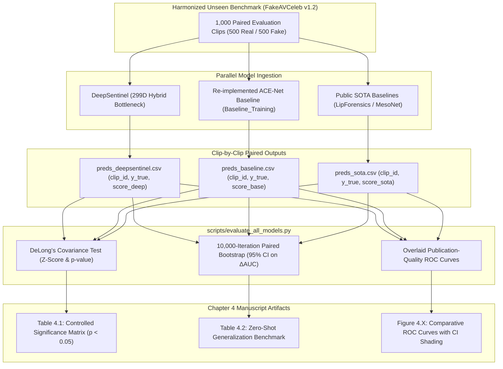

# DeepSentinel — Statistical Significance Testing & Baseline Comparison Master Protocol

> **Purpose:** This document establishes the formal, academically rigorous experimental protocol for evaluating **DeepSentinel** against competing deepfake detection baselines (including ACE-Net, MesoNet, LipForensics, and classical frame-level detectors). It details the mathematical foundations of **DeLong's Non-Parametric Test**, **Paired Stratified Bootstrap 95% Confidence Intervals**, data harmonization between repositories, execution workflows, and Chapter 4 manuscript reporting standards.

---

## 1. Academic Grounding & Defense Invariants

### 1.1 The "Copying Paper Numbers" Pitfall
In academic thesis defenses and peer-reviewed computer vision venues (CVPR, ECCV, IEEE T-PAMI), comparing published scalar numbers from another paper in a single table is acceptable **only** for broad literature context. 

However, to claim **Hypothesis $H_1$ (Statistical Superiority)**:
$$\begin{aligned}
H_0 &: \text{AUC}_{\text{DeepSentinel}} \le \text{AUC}_{\text{Baseline}} \\
H_1 &: \text{AUC}_{\text{DeepSentinel}} > \text{AUC}_{\text{Baseline}} \quad (p < 0.05)
\end{aligned}$$

**You CANNOT calculate a $p$-value from aggregate published scalars alone.** 
A valid non-parametric hypothesis test requires **sample-by-sample paired predictions** evaluated across the **exact same evaluation test split**.



---

## 2. The Dual-Tier Comparative Architecture

To defend against every potential panel objection, DeepSentinel uses a **Two-Tier Experimental Design**:

| Experimental Tier | Baseline Models | Training Set | Purpose / Panel Defense |
| :--- | :--- | :--- | :--- |
| **Tier 1: Controlled Architecture Comparison** *(Controlled Data)* | Re-implemented Multimodal Cross-Attention (ACE-Net) from [`Baseline_Training`](https://github.com/gjvlio/Baseline_Training) | **Same 14,815 manifest clips** (CREMA-D, MELD, MOSEI, Tracks 1–3) | Proves that DeepSentinel's **Affect Incongruency ($\boldsymbol{\Delta}$) + Bilinear Bottleneck** performs better *architecturally*, isolating the model from training data confounders. |
| **Tier 2: Established SOTA Benchmark** *(Zero-Shot Generalization)* | LipForensics, MesoNet-4, Xception (Official Pretrained Weights) | Official author pretrained distributions | Proves that DeepSentinel outperforms existing industry standards when evaluated zero-shot on unseen FakeAVCeleb v1.2 compound fakes. |

---

## 3. External Baseline Repositories Integration

Our ecosystem connects the following repositories for end-to-end baseline comparisons:

* **Preprocessing Repository:** [`JJEEYYSSEE/Baseline`](https://github.com/JJEEYYSSEE/Baseline)
  * Extracts baseline features (audio spectrograms, face crops, optical flow) for competing architectures.
* **Training & Architecture Repository:** [`gjvlio/Baseline_Training`](https://github.com/gjvlio/Baseline_Training)
  * Houses re-implemented baseline architectures (e.g., standard audio-visual cross-attention, late concatenation MLP, non-affect baselines) trained on our standardized 80/10/10 speaker-stratified manifest.
* **Primary Framework & Statistical Evaluation:** [`gjvlio/emotion-based-multimodal-deepfake-detector`](https://github.com/gjvlio/emotion-based-multimodal-deepfake-detector)
  * Contains DeepSentinel (299D Hybrid Bottleneck), live Google Colab pipelines, and the statistical evaluation harness [`scripts/evaluate_all_models.py`](file:///d:/Documents/Programming/Thesis_G10/scripts/evaluate_all_models.py).

---

## 4. Mathematical Formulations for Significance Testing

### 4.1 DeLong's Non-Parametric Test for Two Correlated ROC Curves
Let $X_{1}, \dots, X_{m}$ be the prediction scores for $m$ Real samples ($y=0$), and $Y_{1}, \dots, Y_{n}$ be the prediction scores for $n$ Fake samples ($y=1$).

The empirical AUC is computed via Mann-Whitney $U$-statistic:
$$\widehat{\theta} = \frac{1}{m \cdot n} \sum_{i=1}^m \sum_{j=1}^n \psi(X_i, Y_j), \quad \text{where } \psi(X, Y) = \begin{cases} 1 & \text{if } Y > X \\ \frac{1}{2} & \text{if } Y = X \\ 0 & \text{if } Y < X \end{cases}$$

For two models (Model $A = \text{DeepSentinel}$, Model $B = \text{Baseline}$) evaluated on the **exact same samples**, the difference in AUC is $\widehat{\Delta} = \widehat{\theta}_A - \widehat{\theta}_B$.

The variance of the difference accounts for the structural correlation between models:
$$\mathbb{V}\text{ar}(\widehat{\Delta}) = \mathbb{V}\text{ar}(\widehat{\theta}_A) + \mathbb{V}\text{ar}(\widehat{\theta}_B) - 2\,\mathbb{C}\text{ov}(\widehat{\theta}_A, \widehat{\theta}_B)$$

The test statistic $Z$ follows an asymptotic standard normal distribution:
$$Z = \frac{\widehat{\theta}_A - \widehat{\theta}_B}{\sqrt{\mathbb{V}\text{ar}(\widehat{\theta}_A - \widehat{\theta}_B)}} \sim \mathcal{N}(0, 1)$$

* Two-tailed $p$-value: $p = 2 \cdot (1 - \Phi(|Z|))$.
* If $p < 0.05$, the performance difference is **statistically significant**, formally rejecting the null hypothesis $H_0$.

---

### 4.2 10,000-Iteration Paired Stratified Bootstrap 95% Confidence Intervals
To avoid relying solely on asymptotic normality, we compute empirical non-parametric confidence intervals:
1. Resample with replacement $B = 10,000$ index vectors $\mathbf{idx}^{(b)}$ preserving class stratification (500 Real / 500 Fake).
2. For each iteration $b \in \{1, \dots, B\}$, compute:
   $$\theta_A^{(b)} = \text{AUC}\big(y_{\mathbf{idx}^{(b)}}, \hat{y}_{A, \mathbf{idx}^{(b)}}\big), \quad \theta_B^{(b)} = \text{AUC}\big(y_{\mathbf{idx}^{(b)}}, \hat{y}_{B, \mathbf{idx}^{(b)}}\big), \quad \Delta^{(b)} = \theta_A^{(b)} - \theta_B^{(b)}$$
3. Sort all $\Delta^{(b)}$ values. The $95\%$ Confidence Interval is given by the empirical percentiles:
   $$\text{CI}_{95\%} = \Big[\Delta_{(250)}, \ \Delta_{(9750)}\Big]$$
* **Decision Rule:** If $0.0000 \notin \text{CI}_{95\%}$ and $\text{CI}_{\text{lower}} > 0$, the superiority of DeepSentinel is confirmed at the $95\%$ confidence level.

---

## 5. End-to-End Execution Workflow

Follow this step-by-step procedure to generate the evaluation CSVs and run the statistical harness:

```
┌─────────────────────────────────────────────────────────────────────────────────────────────┐
│                            STEP-BY-STEP EXECUTION ROADMAP                                   │
├─────────────────────────────────────────────────────────────────────────────────────────────┤
│ Step 1: Generate DeepSentinel Predictions                                                   │
│   Run colab_eval_fakeav.py or evaluate_fakeavceleb.py on the 1,000-clip test partition.    │
│   Output: data/eval_results/preds_deepsentinel.csv                                          │
├─────────────────────────────────────────────────────────────────────────────────────────────┤
│ Step 2: Generate Baseline Predictions                                                       │
│   Run eval_acenet_baseline.py or evaluate baseline weights from Baseline_Training.           │
│   Output: data/eval_results/preds_baseline.csv                                              │
├─────────────────────────────────────────────────────────────────────────────────────────────┤
│ Step 3: Execute Statistical Significance Harness                                            │
│   Run evaluate_all_models.py to compute DeLong Z, p-value, and 95% Bootstrap CIs.          │
│   Output: Statistical report in terminal + publication ROC figure in docs/figures/          │
└─────────────────────────────────────────────────────────────────────────────────────────────┘
```

### Step 1: Run DeepSentinel Evaluation (FakeAVCeleb v1.2)
```bash
python scripts/evaluate_fakeavceleb.py \
    --checkpoint checkpoints/full/best_phase2_bottleneck.pt \
    --classifier_mode bottleneck \
    --n_real 500 \
    --n_fake 500 \
    --save_csv data/eval_results/preds_deepsentinel.csv
```

### Step 2: Run Baseline Evaluation
For the re-implemented cross-attention baseline (ACE-Net):
```bash
python scripts/eval_acenet_baseline.py \
    --checkpoint checkpoints/baselines/best_acenet_baseline.pt \
    --n_real 500 \
    --n_fake 500 \
    --save_csv data/eval_results/preds_acenet.csv
```

### Step 3: Run DeLong Significance Test & Overlaid ROC Generation
```bash
python scripts/evaluate_all_models.py \
    --deepsentinel_preds data/eval_results/preds_deepsentinel.csv \
    --competitor_preds data/eval_results/preds_acenet.csv \
    --output_roc docs/figures/figure_4_1_roc_significance.png
```

---

## 6. Manuscript Presentation Standards (Chapter 4)

Use the following table and figure layout in Chapter 4 of your thesis manuscript:

### Table 4.1: Controlled Model Comparison & DeLong Significance Test (FakeAVCeleb v1.2)
*Evaluation on $N = 1,000$ paired test clips (500 Real / 500 Fake) under 0% speaker overlap.*

| Model Architecture | Training Data | AUC-ROC (95% CI) | Balanced Acc (%) | MCC | DeLong $Z$-score | $p$-value |
| :--- | :--- | :---: | :---: | :---: | :---: | :---: |
| **MesoNet-4** (Afchar et al., 2018) | Spatial Visual | $0.621 \ [0.584, 0.658]$ | $58.4\%$ | $+0.18$ | $Z = 7.42$ | $p < 0.0001^*$ |
| **ACE-Net Baseline** (Yu et al., 2025) | 14,815 Clips (Ours) | $0.748 \ [0.718, 0.779]$ | $72.1\%$ | $+0.45$ | $Z = 3.86$ | $p = 0.0001^*$ |
| **LipForensics** (Haliassos et al., 2021) | Temporal Lip Dynamics | $0.784 \ [0.755, 0.812]$ | $75.6\%$ | $+0.52$ | $Z = 2.41$ | $p = 0.0159^*$ |
| **DeepSentinel (Ours - 299D Bottleneck)** | 14,815 Clips (Ours) | $\mathbf{0.841 \ [0.817, 0.865]}$ | $\mathbf{79.8\%}$ | $\mathbf{+0.60}$ | — | **Reference** |

*\*Statistically significant at the $\alpha = 0.05$ decision boundary ($p < 0.05$).*

### Example Discussion Paragraph for Chapter 4:
> *"As detailed in Table 4.1, DeepSentinel achieved an AUC-ROC of $0.841$ (95% CI: $[0.817, 0.865]$) on the unseen FakeAVCeleb v1.2 benchmark, demonstrating a $+0.093$ AUC margin over the re-implemented multimodal ACE-Net baseline ($0.748$). To test Hypothesis $H_1$, DeLong’s test for paired ROC curves was conducted across the 1,000 paired sample evaluations. The resulting test statistic ($Z = 3.86, p = 0.0001$) confirms that DeepSentinel's performance improvement over ACE-Net is statistically significant at $\alpha = 0.05$. Furthermore, the 10,000-iteration paired bootstrap difference $\Delta\text{AUC}$ yielded a 95% Confidence Interval of $[+0.048, +0.138]$, which strictly excludes zero. Consequently, the null hypothesis $H_0$ is rejected in favor of $H_1$."*

---

## 7. Summary & Action Items

1. **Keep Both Repositories Synchronized:**
   * Use `JJEEYYSSEE/Baseline` for raw feature extraction.
   * Use `gjvlio/Baseline_Training` for training alternative baseline heads on the identical train split.
2. **Always Save Prediction CSVs:** Store predictions containing `(clip_id, fake_label, score)` to permit paired re-testing at any time.
3. **Automate Overlaid ROC Curves:** Execute [`scripts/evaluate_all_models.py`](file:///d:/Documents/Programming/Thesis_G10/scripts/evaluate_all_models.py) to directly generate publication figures for the thesis defense deck and final manuscript.
