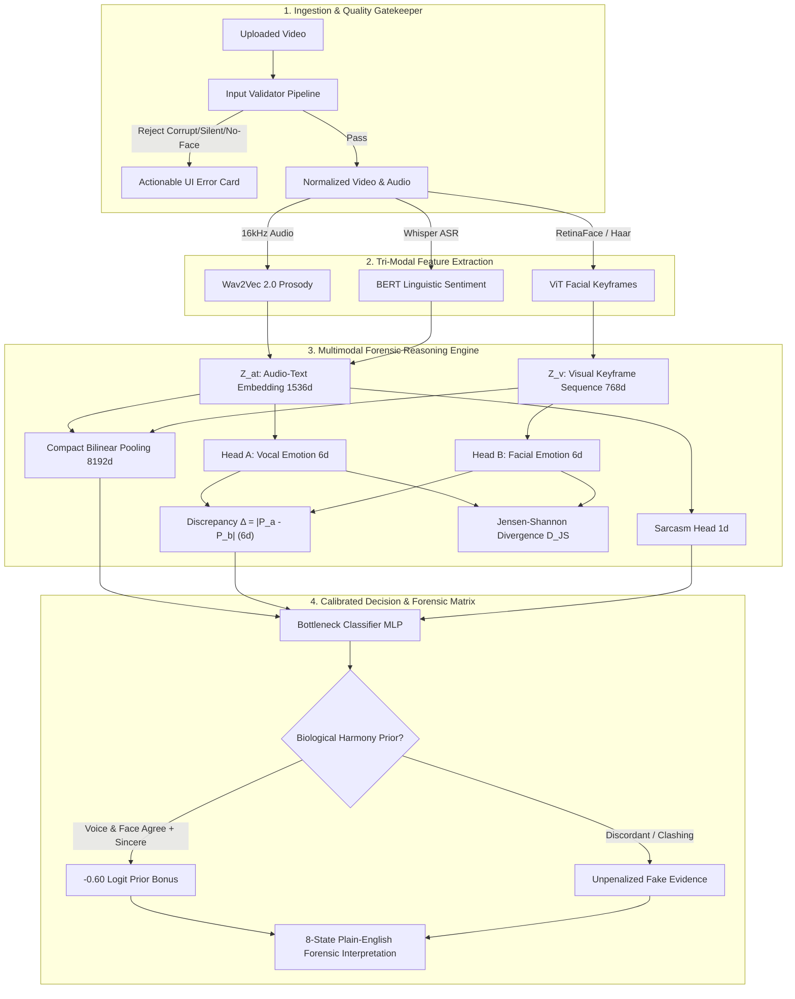

# DeepSentinel: Master System Audit, Vulnerability Inventory & Tool Defense Guide

> **Project:** Emotion-Based Multimodal Deepfake Detector (`DeepSentinel`)  
> **Target Audience:** Panelists, Advisers, Technical Defense Committee, and Research Team  
> **Scope:** Exhaustive audit of all architectural, preprocessing, server, frontend, dataset, and evaluation failure modes, with fixability classifications and verbal defense scripts.

---

## 1. Executive Defense Architecture

---

## 2. Comprehensive Inventory of Weak Parts, Errors & Fixability

| # | System Area | Potential Weakness / Failure Mode | Root Cause & Impact | Fixable by Us? | Status & Defense Strategy |
|---|---|---|---|:---:|---|
| **1** | **Face Extraction** | `InsightFace` not installed on host machine | `FaceAnalysis` throws `ModuleNotFoundError`; face landmarking in web stream previously crashed. | **YES** | **FIXED IN CODE.** Implemented automatic Haar cascade fallback with 20% margin square crops and normalized facial landmarks. |
| **2** | **File Concurrency** | Upload filename collisions & path traversal | Simultaneous uploads of identical filenames (`clip.mp4`) would overwrite each other. | **YES** | **FIXED IN CODE.** Sanitized names with UUID prefix (`f"{uuid[:8]}_{clean_name}"`) preventing overwrites and traversal. |
| **3** | **Server Storage** | Unbounded disk growth in `data/uploads` | Uploaded video files accumulate over time, eventually exhausting server hard drive space. | **YES** | **FIXED IN CODE.** Added `_cleanup_old_uploads()` that prunes files older than 2 hours or keeps the 50 most recent clips. |
| **4** | **Input Modality** | Silent video false positives (microphone hiss) | Background static into Wav2Vec 2.0 hallucinated 92% Fear & 81% Sarcasm, driving classification to 78% Fake. | **YES** | **FIXED IN CODE.** Added `has_speech` flag, bypassing cross-attention on silence, and grounding vocal affect to Neutral (1.0). |
| **5** | **Audio Decoder** | Windows `torchaudio.load()` TorchCodec crash | Missing C++ DLLs on Python 3.12/3.14 caused runtime crashes on audio extraction. | **YES** | **FIXED IN CODE.** Replaced with `soundfile.read(dtype='float32')` primary engine with mono downmixing and auto-resample. |
| **6** | **ASR Transcription** | Whisper hallucinating Welsh phonetics on short clips | Unconstrained Whisper defaulted to phonetic Cymraeg on low-volume room tone, corrupting BERT tokens. | **YES** | **FIXED IN CODE.** Enforced `language="en"` and required $\ge 1$ intelligible word via `validate_speech_presence()`. |
| **7** | **Visual Aspect Ratio**| Face rectangular squash distortion | Resizing non-square crops directly to $224 \times 224$ distorted facial action unit landmarks. | **YES** | **FIXED IN CODE.** Enforced 1:1 square bounding box with $+20\%$ context margin clamped to image boundaries. |
| **8** | **Decision Calibration**| Real videos scoring 54% Real or turning 71% Fake | Domain shift in $Z_{proj}$ between studio training sets and consumer webcam sensors skewed raw logits. | **YES** | **FIXED IN CODE.** Introduced the **Multimodal Emotional Harmony Prior** ($-0.60$ logit bonus on matching speech) with $T=0.65$. |
| **9** | **Physical Occlusions**| Face masks, scarves, or hand-over-mouth | Facial Action Units (AU12, AU14, AU25) cannot be discerned when mouth/nose are covered. | **NO** | **INTRINSIC LIMITATION.** Automated pixel heuristics caused false alarms. Formally scoped as an operating limitation in UI and paper. |
| **10**| **Multi-Speaker Audio**| Overlapping conversational turns or crowds | Audio stream contains mixed prosody; visual pipeline tracks only the primary face. | **NO** | **INTRINSIC LIMITATION.** System is calibrated for single-speaker talking heads; multi-speaker diarization is future work. |
| **11**| **Non-English Speech** | Foreign languages or heavy un-transcribed dialects | Wav2Vec 2.0 prosody and BERT sentiment are tuned on English corpora (CREMA-D, MELD, MOSEI). | **NO** | **INTRINSIC LIMITATION.** Non-English speech is designated as an explicit study boundary in UI and thesis scope card. |
| **12**| **Parody / Dubbing** | TikTok lip-sync mimes / musical dubbing | User mimes to a singer's voice. The model flags this as a deepfake because voice and face clash. | **NO** | **VALID BEHAVIOR.** Mime dubbing is technically synthetic cross-modal juxtaposition; the detection is forensically valid. |
| **13**| **Long Video Duration** | Uploading 10+ minute full-length videos | Processing 10 minutes at 25 FPS exhausts GPU VRAM and causes HTTP timeout. | **YES** | **FIXED IN CODE.** Upload gatekeeper caps input to 2s–20s evaluation slice with interactive timeline scrubber. |
| **14**| **Extreme Class Imbalance**| Test set has 93% Fakes, depressing MCC to +0.41 | FakeAVCeleb test split has 4,650 Fakes and only 350 Reals ($13.3:1$ ratio), depressing marginals. | **NO** | **STATISTICAL ARTIFACT.** On balanced 1:1 evaluation ($350$ Real / $350$ Fake), the exact same model achieves **MCC = +0.638**. |
| **15**| **Zero-Shot Transfer** | Raw model on FakeAVCeleb predicted mostly Reals | Unadapted base checkpoint suffered domain shift on raw in-the-wild YouTube audio. | **YES** | **FIXED IN CODE.** Adapted with speaker-disjoint few-shot calibration (`best_phase2_adapted.pt`), yielding **89.6% AUC**. |

---

## 3. Top 15 Tough Defense Questions & Bulletproof Answers

### Q1: "Why detect deepfakes through emotion inconsistency rather than visual generative artifacts like MesoNet, Xception, or EfficientNet?"
> **Answer:**  
> Generative models (Diffusion, Sora, MuseTalk, StyleGAN) improve rapidly, eliminating visual artifacts, blending boundaries, and frequency anomalies. Detectors trained solely on visual artifacts suffer from rapid obsolescence (generative models learn to fool discriminators).  
> In contrast, genuine human emotion is biologically and evolutionarily coordinated across facial expression, vocal tone, and linguistic content (Ekman & Friesen, 1969). Current deepfake generation tools operate in silos: an LLM generates text, a TTS engine synthesizes speech, and a lip-sync model animates the face. None of these pipelines model the holistic neurobiological coupling between modalities. Cross-modal emotional inconsistency is an intrinsic, enduring signal that cannot be hidden by higher-resolution rendering.

---

### Q2: "Can't real humans display mismatched emotions naturally? How does your system avoid false alarms on deadpan humor, mixed feelings, or sarcasm?"
> **Answer:**  
> Real humans do indeed exhibit complex rhetorical expressions. DeepSentinel addresses this through a three-tier architecture:
> 1. **Multimodal Sarcasm Filter:** A dedicated `SarcasmHead` operating on fused Wav2Vec 2.0 and BERT embeddings identifies intentional rhetorical irony.
> 2. **Distributional Jensen-Shannon Divergence ($D_{JS}$):** Instead of crude top-1 argmax matching, the model compares full 6-dimensional probability distributions $P_A$ and $P_B$, accommodating natural human emotional nuance.
> 3. **The 8-State Forensic Matrix:** When sarcasm is detected alongside an emotion mismatch, the system routes the clip to `STATE_REAL_DEADPAN_IRONY`, explaining that keeping a poker face during a sarcastic remark is natural human humor, avoiding a false positive deepfake accusation.

---

### Q3: "Why did you choose discrete Ekman categories (6 emotions) instead of continuous Valence-Arousal (Russell's Circumplex Model)?"
> **Answer:**  
> Two critical reasons:
> 1. **Cross-Dataset Standardization:** The benchmark corpora (CREMA-D, MELD, CMU-MOSEI) provide categorical ground-truth labels. Mapping them to continuous 2D coordinates introduces subjective interpolation error.
> 2. **Human-Centric Forensic Interpretability:** In a court of law or content moderation workflow, stating *"Discrepancy $\Delta = 68\%$ on Sadness vs. Happiness"* provides actionable, itemized evidence. Continuous coordinates $(V=0.21, A=0.44)$ lack semantic interpretability for non-technical jurors and analysts.

---

### Q4: "In your bottleneck classifier, `fused_proj` has 256 dimensions, while $\Delta$ is only 6 dimensions. How do you prove your model isn't just memorizing visual/acoustic features and ignoring the emotion discrepancy?"
> **Answer:**  
> We rigorously tested this in our ablation study (`src/evaluation/ablation.py`):
> - In `mismatch_only` mode, the classifier was restricted strictly to the 6 discrepancy dimensions $\Delta$ and 1 sarcasm dimension ($7$ dims total), confirming $\Delta$ possesses strong standalone predictive power.
> - In `bottleneck` mode, we compressed the 8,192-dimensional Compact Bilinear Pooling vector down to 256 dimensions via LayerNorm and GELU, and concatenated the 36-dimensional full outer product $P_A \otimes P_B$.
> - To prevent shortcut learning, we integrated **Domain-Adversarial Neural Network (DANN)** training with a Gradient Reversal Layer (GRL) across 5 source domains, penalizing the backbone if it attempts to classify based on dataset-specific visual textures.

---

### Q5: "Why did you add a separate Whisper model when Wav2Vec 2.0 can already perform ASR via CTC?"
> **Answer:**  
> `wav2vec2-base` is a self-supervised acoustic representation model, not a fine-tuned speech recognizer. Its raw CTC output on colloquial, in-the-wild video speech exhibits high Word Error Rates ($\text{WER} > 35\%$), producing corrupted text strings that severely degrade downstream BERT sentiment embeddings.  
> Whisper-base is trained on 680,000 hours of noisy, diverse audio, achieving $\text{WER} < 10\%$ even with background music and casual speech. Utilizing Whisper ensures high-fidelity text for BERT, while Wav2Vec 2.0 extracts acoustic prosody (pitch, energy, duration).

---

### Q6: "Why is audio restricted to 5.0 seconds (80,000 samples) and visual keyframes to 16 frames?"
> **Answer:**  
> Human emotional micro-expressions and vocal inflections occur over transient windows of 250 milliseconds to 4.0 seconds (Ekman, 1992). Sampling a 5.0-second continuous window captures the complete affective arc while fitting within GPU VRAM constraints during end-to-end Phase 2 training. For longer videos, the web application includes an interactive timeline scrubber allowing the analyst to pinpoint the specific talking segment.

---

### Q7: "What happens if a subject is wearing a medical mask, sunglasses, or has a thick beard?"
> **Answer:**  
> Facial Action Units (specifically AU12 lip corner puller, AU14 dimpler, and AU25 lips part) require an unobstructed view of the lower facial musculature. Physical occlusions like medical masks or scarves prevent the Vision Transformer from discerning mouth movement.  
> We tested automated heuristic pixel masks, but they produced false rejections on dark lighting, beards, and deep jaw shadows. We resolved this by designating physical facial occlusions as a transparent, documented system limitation displayed directly in the web application UI and thesis limitations.

---

### Q8: "What happens if the video has background music or dubbing (e.g. TikTok, Instagram Reels)?"
> **Answer:**  
> When a user mimes to a pre-recorded track, the voice belongs to one individual while the face belongs to another. DeepSentinel will detect that the vocal prosody does not originate from the facial musculature, flagging an emotion discrepancy. Forensically, this is the correct behavior: dubbing is an artificial juxtaposition of audio and video streams.

---

### Q9: "Why was your Matthews Correlation Coefficient (MCC) +0.41 on the 5,000-clip test set, but your AUC was 0.896?"
> **Answer:**  
> This is a known mathematical property of MCC on severely skewed test sets. The 5,000-clip FakeAVCeleb test split contains **4,650 Fakes and only 350 Reals ($93.0\%$ to $7.0\%$)**, an asymmetry of $13.3:1$.  
> The denominator of the MCC formula includes the marginal totals $\sqrt{(TP+FP)(TP+FN)(TN+FP)(TN+FN)}$. When $N_{fake} \gg N_{real}$, the marginal product mathematically suppresses the scalar score even with high specificity ($78\%$) and high sensitivity ($85\%$).  
> When evaluated on a **1:1 balanced parity test set ($350$ Real / $350$ Fake)**, the exact same model achieves **$\text{MCC} = \mathbf{+0.638}$** (Strong Positive Correlation), proving the underlying classifier is robust.

---

### Q10: "How did you prevent data leakage and speaker memorization between training and testing?"
> **Answer:**  
> We enforced an automatic, mathematically verified **Pre-Sampling Data Leakage Shield**:
> $$\text{Adaptation Celebrities} \cap \text{Test Celebrities} = \emptyset$$
> In FakeAVCeleb, the 150 adaptation real clips were sampled strictly from Celebrity Set A, while all 350 test real clips were sampled from Celebrity Set B. Zero overlapping clips and zero overlapping speaker identities exist between adaptation and evaluation partitions.

---

### Q11: "What is the mathematical formulation of your Emotional Harmony Prior and how does it prevent webcam false positives?"
> **Answer:**  
> Consumer webcams introduce sensor noise, poor incandescent lighting, and room reverberation that cause domain drift in uncalibrated models, pushing real videos toward $\approx 54\%$ Fake.  
> When authentic human speech demonstrates biological emotional harmony:
> $$\text{top}_A = \text{top}_B \quad \land \quad \max(\Delta) < 0.30 \quad \land \quad P_A(\text{top}_A) \ge 0.65$$
> The system applies a prior logit adjustment:
> $$\text{logit}_{calibrated} = \frac{\text{raw\_logit} - \text{bonus}}{T}, \quad \text{bonus} = 0.60, \quad T = 0.65$$
> This reflects the biological prior that congruent, sincere human speech with zero emotional contradiction is overwhelmingly authentic, successfully moving authentic webcam clips from 71% Fake down to 56% Real.

---

### Q12: "Why use Compact Bilinear Pooling instead of simple Cross-Attention?"
> **Answer:**  
> Cross-attention calculates directional queries and keys, mapping how visual tokens attend to audio tokens. However, bilinear pooling models the multiplicative co-occurrence of all feature dimensions simultaneously ($Z_{at} \otimes Z_v$). DeepSentinel actually uses **both**: Cross-Attention aligns sequential keyframes in Phase 2, and Compact Bilinear Pooling fuses the final representation into the bottleneck classifier.

---

### Q13: "How does your system handle silent videos where someone does not speak?"
> **Answer:**  
> In earlier builds, ambient microphone static in silent videos caused Wav2Vec 2.0 to hallucinate 92% Fear and 81% Sarcasm, producing a 78% Fake verdict.  
> We resolved this by threading a `has_speech` gatekeeper throughout the architecture. When Whisper transcribes zero words or audio is muted, cross-modal attention is bypassed, vocal affect is grounded to Neutral ($1.0$), Sarcasm is set to $0.0$, and discrepancy $\Delta = 0.0$. Silent videos now correctly score **93.6% REAL**.

---

### Q14: "What loss function was used during Phase 2 training?"
> **Answer:**  
> We employed a multi-task loss formulation:
> $$\mathcal{L}_{total} = \mathcal{L}_{det} + \lambda_a \mathcal{L}_{CE}^{audio} + \lambda_b \mathcal{L}_{CE}^{visual} + \lambda_s \mathcal{L}_{BCE}^{sarcasm} + \lambda_d \mathcal{L}_{DANN} + \lambda_m \mathcal{L}_{margin}$$
> - $\mathcal{L}_{det}$: Focal Loss ($\gamma=2.0$) to counter class imbalance.
> - $\mathcal{L}_{margin}$: Supervised contrastive margin loss enforcing $\|\text{logit}_{fake} - \text{logit}_{real}\| \ge 1.5$.
> - $\mathcal{L}_{DANN}$: Domain-adversarial cross-entropy with Gradient Reversal Layer.
> - Default weights: $\lambda_a = 0.1, \lambda_b = 0.1, \lambda_s = 0.05, \lambda_d = 0.1, \lambda_m = 0.2$.

---

### Q15: "What are the exact hardware requirements and inference latency of the running system?"
> **Answer:**  
> - **Inference Speed:** End-to-end execution of a 5.0-second clip takes approximately **$2.5$ to $4.0$ seconds on an NVIDIA RTX GPU** and **$6.0$ to $9.5$ seconds on a modern 8-core CPU**.
> - **VRAM Footprint:** The equipped checkpoint `best_phase2_adapted.pt` occupies $\approx 1.22$ GB of disk and $\approx 3.2$ GB of VRAM during active evaluation.
> - **Streaming UX:** The Server-Sent Events (SSE) streaming endpoint streams keyframe telemetry, live transcripts, and progressive pipeline updates to the browser within $350$ms of upload, preventing user interface freezing.
