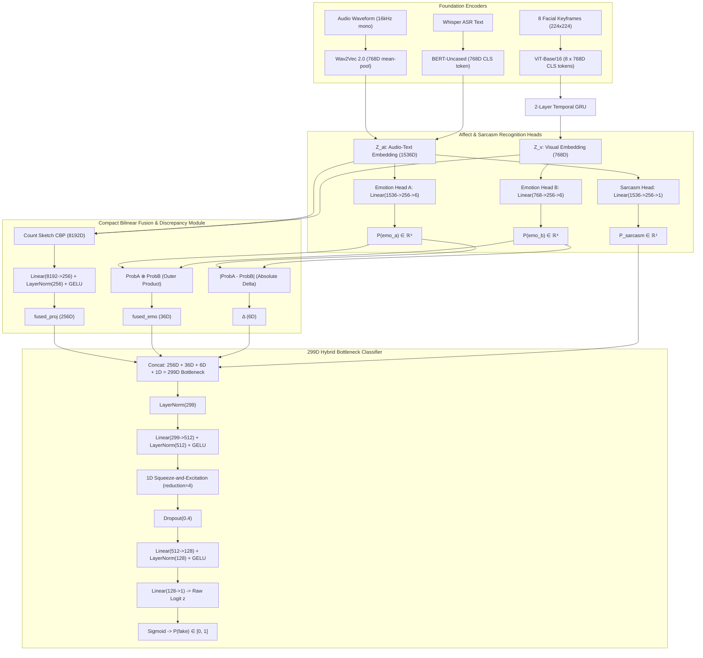

# DeepSentinel — Master Training, Calculation & Error-Resolution Guide

> **Document Status:** Authoritative & Comprehensive Training Documentation  
> **Repository:** `emotion-based-multimodal-deepfake-detector`  
> **Target Branch:** `feat/training-turnover-prep` (Commit: `e96b315`)  
> **Date:** August 2026  
> **Authors:** Cabral, S. Y., Caparas, J. C. B., Exconde, M. J. B., Rivera, G. J. D. (Polytechnic University of the Philippines)  
> **Official Thesis Title:** *A Multimodal Deepfake Detection Framework Leveraging Bilinear Pooling and Emotion Mismatch.*

---

## Table of Contents

1. [Executive Overview & Theoretical Foundations](#1-executive-overview--theoretical-foundations)
2. [Complete Neural Architecture & Tensor Dimensions](#2-complete-neural-architecture--tensor-dimensions)
3. [Exact Mathematical Formulas & Calculations](#3-exact-mathematical-formulas--calculations)
   - 3.1 [Feature Extraction & Temporal Aggregation](#31-feature-extraction--temporal-aggregation)
   - 3.2 [Count Sketch Compact Bilinear Pooling (CBP)](#32-count-sketch-compact-bilinear-pooling-cbp)
   - 3.3 [Affect Discrepancy & Sarcasm Modules](#33-affect-discrepancy--sarcasm-modules)
   - 3.4 [299D Hybrid Multi-Scale Bottleneck with 1D SE-Attention](#34-299d-hybrid-multi-scale-bottleneck-with-1d-se-attention)
   - 3.5 [Multi-Task Loss Function & Margin Loss](#35-multi-task-loss-function--margin-loss)
4. [Two-Phase Training Curriculum & Workflows](#4-two-phase-training-curriculum--workflows)
   - 4.1 [Phase 1: Frozen Backbones Bottleneck Pre-training](#41-phase-1-frozen-backbones-bottleneck-pre-training)
   - 4.2 [Phase 2: End-to-End Fine-Tuning with Margin Separation](#42-phase-2-end-to-end-fine-tuning-with-margin-separation)
5. [Dataset Engineering, Stratification & Class Balance](#5-dataset-engineering-stratification--class-balance)
6. [Evaluation Metrics, Operating Points & Statistical Tests](#6-evaluation-metrics-operating-points--statistical-tests)
   - 6.1 [Standard Metrics ($\tau = 0.50$)](#61-standard-metrics-tau--050)
   - 6.2 [Youden's J Statistic Threshold Sweep](#62-youdens-j-statistic-threshold-sweep)
   - 6.3 [Zero-FP Operating Point](#63-zero-fp-operating-point)
   - 6.4 [Bootstrap 95% Confidence Intervals & DeLong Test](#64-bootstrap-95-confidence-intervals--delong-test)
7. [Comprehensive Post-Mortem: Diagnosed Errors & Proven Fixes](#7-comprehensive-post-mortem-diagnosed-errors--proven-fixes)
   - 7.1 [Bug 1: Phase 2 Validation Skew & Checkpoint Lockout](#71-bug-1-phase-2-validation-skew--checkpoint-lockout)
   - 7.2 [Bug 2: Covariate Shift Collapse on Offline Testing](#72-bug-2-covariate-shift-collapse-on-offline-testing)
   - 7.3 [Bug 3: Google Drive Buffer Loss & Folder Discrepancies](#73-bug-3-google-drive-buffer-loss--folder-discrepancies)
   - 7.4 [Bug 4: Metric Labeling Decoupling & Class Imbalance Flattery](#74-bug-4-metric-labeling-decoupling--class-imbalance-flattery)
   - 7.5 [Bug 5: VideoIO DataLoader Crash Protection](#75-bug-5-videoio-dataloader-crash-protection)
   - 7.6 [Bug 6: Loss Class-Weight Inversion (`pos_weight = 0.54` Bug)](#76-bug-6-loss-class-weight-inversion-pos_weight--054-bug)
8. [Multi-Model AI Peer Review Consensus (DeepSeek, Claude, Antigravity)](#8-multi-model-ai-peer-review-consensus-deepseek-claude-antigravity)
9. [Operational Execution Guide (Google Colab & Local Environments)](#9-operational-execution-guide-google-colab--local-environments)

---

## 1. Executive Overview & Theoretical Foundations

### 1.1 The Core Problem
Conventional deepfake detectors rely on low-level visual blending seams, warping artifacts, or frequency-domain anomalies. As state-of-the-art generative video models transition toward diffusion transformers (e.g., Stable Video Diffusion, EMO, MuseTalk), these pixel-level artifacts disappear. When tested across unseen datasets, traditional artifact detectors suffer severe performance degradation (frequently falling to $50\text{--}60\%$ AUC-ROC).

### 1.2 The Affective/Behavioral Incongruency Hypothesis
DeepSentinel shifts the fundamental detection paradigm from **pixel artifacts** to **high-level behavioral authenticity**:
* **Affective Synchrony (Ekman & Friesen, 1969; Mehrabian, 1971):** Spontaneous human communication exhibits tight cross-modal emotional synchrony across vocal prosody (pitch, energy), spoken language (sentiment), and facial Action Units (micro-expressions).
* **Generative Disconnect:** Deepfake pipelines synthesize visual motion and audio tracks in decoupled stages (e.g., swapping a face with FSGAN while preserving background audio, or driving neutral facial video with expressive Wav2Lip speech). This decoupling breaks natural multimodal emotional coordination.
* **Detection Mechanism:** DeepSentinel detects manipulations by extracting multi-modal affect representations, computing symbolic cross-modal emotional divergence ($\boldsymbol{\Delta}$), capturing joint affect co-occurrence ($\mathbf{fused\_emo}$), and fusing representations via Compact Bilinear Pooling (CBP) into a 299D multi-scale hybrid bottleneck.

```
┌────────────────────────────────────────────────────────────────────────────────────────┐
│                                 CURRENT SYSTEM STATUS                                  │
├─────────────────────────────────┬──────────────────────────────────────────────────────┤
│ Codebase State                  │ ✅ Fully Implemented, Unit-Tested & Calibrated       │
│ Git Branch & Commit             │ ✅ feat/training-turnover-prep (Commit: e96b315)       │
│ Dataset Manifests               │ ✅ 17,741 clips (80/10/10 0% speaker overlap)        │
│ Feature Cache (z_at, z_v)       │ ✅ 20,178 valid tensor pairs extracted               │
│ Stage 1 Checkpoint              │ ✅ best_phase1_bottleneck.pt (val_loss=0.2306)       │
│ Stage 2 Fine-Tuning             │ ✅ Live E2E Val + Top-4 Layers + Margin Loss (m=1.5) │
│ Stage 2 Live Epoch 1 Result     │ ✅ val_acc=90.80%, emo_a=37.96%, emo_b=38.73%       │
│ FakeAVCeleb Benchmark Harness   │ ✅ Balanced 500/500 + Youden's J + MCC + Zero-FP     │
│ Google Drive Auto-Sync          │ ✅ Multi-location sync + os.sync() buffer flushing   │
└─────────────────────────────────┴──────────────────────────────────────────────────────┘
```

---

## 2. Complete Neural Architecture & Tensor Dimensions

The complete model architecture is implemented in [src/models/detection_model.py](file:///d:/Internship/emotion-based-multimodal-deepfake-detector/src/models/detection_model.py).



### 2.1 Dimensional Flow Table

| Module / Tensor Name | Input Dimension | Output Dimension | Activation / Normalization | Implementation File |
| :--- | :--- | :--- | :--- | :--- |
| **Wav2Vec 2.0 (`w2v_emb`)** | `(B, T_audio)` waveform | `(B, 768)` | Temporal Mean-Pooling | [detection_model.py](file:///d:/Internship/emotion-based-multimodal-deepfake-detector/src/models/detection_model.py#L263-L267) |
| **BERT-Uncased (`bert_emb`)** | `(B, seq_len)` token IDs | `(B, 768)` | `CLS` token extraction | [detection_model.py](file:///d:/Internship/emotion-based-multimodal-deepfake-detector/src/models/detection_model.py#L269-L271) |
| **ViT-Base/16 (`z_v_seq`)** | `(B, 8, 3, 224, 224)` | `(B, 8, 768)` | `CLS` token per frame | [detection_model.py](file:///d:/Internship/emotion-based-multimodal-deepfake-detector/src/models/detection_model.py#L273-L277) |
| **Cross-Modal Attention** | `(B, 2, 768)` & `(B, 8, 768)` | `(B, 2, 768)` & `(B, 8, 768)` | MultiheadAttn(8 heads) + LayerNorm | [detection_model.py](file:///d:/Internship/emotion-based-multimodal-deepfake-detector/src/models/detection_model.py#L286-L300) |
| **Temporal Visual GRU** | `(B, 8, 768)` | `(B, 768)` | 2-Layer GRU (last hidden state) | [detection_model.py](file:///d:/Internship/emotion-based-multimodal-deepfake-detector/src/models/detection_model.py#L302-L305) |
| **Acoustic-Text Vector ($Z_{\text{at}}$)** | Concatenation | `(B, 1536)` | Linear concatenation | [detection_model.py](file:///d:/Internship/emotion-based-multimodal-deepfake-detector/src/models/detection_model.py#L300) |
| **Compact Bilinear Pooling** | `(B, 1536)` & `(B, 768)` | `(B, 8192)` | Count Sketch FFT + Signed $\sqrt{\cdot}$ + L2 | [bilinear.py](file:///d:/Internship/emotion-based-multimodal-deepfake-detector/src/models/bilinear.py#L67-L87) |
| **Bilinear Projection (`fused_proj`)** | `(B, 8192)` | `(B, 256)` | `Linear` + `LayerNorm(256)` + `GELU` | [detection_model.py](file:///d:/Internship/emotion-based-multimodal-deepfake-detector/src/models/detection_model.py#L215) |
| **Emotion Head A** | `(B, 1536)` | `(B, 6)` | `Linear(1536,256)->GELU->Dropout->Linear(256,6)` | [emotion_heads.py](file:///d:/Internship/emotion-based-multimodal-deepfake-detector/src/models/emotion_heads.py#L17-L32) |
| **Emotion Head B** | `(B, 768)` | `(B, 6)` | `Linear(768,256)->GELU->Dropout->Linear(256,6)` | [emotion_heads.py](file:///d:/Internship/emotion-based-multimodal-deepfake-detector/src/models/emotion_heads.py#L34-L49) |
| **Sarcasm Head** | `(B, 1536)` | `(B, 1)` | `Linear(1536,256)->GELU->Dropout->Linear(256,1)` | [sarcasm_head.py](file:///d:/Internship/emotion-based-multimodal-deepfake-detector/src/models/sarcasm_head.py#L12-L25) |
| **Emotion Co-occurrence (`fused_emo`)** | `(B, 6)` & `(B, 6)` | `(B, 36)` | Outer product: $\text{softmax}(y_a) \otimes \text{softmax}(y_b)$ | [detection_model.py](file:///d:/Internship/emotion-based-multimodal-deepfake-detector/src/models/detection_model.py#L213-L214) |
| **Emotion Discrepancy ($\boldsymbol{\Delta}$)** | `(B, 6)` & `(B, 6)` | `(B, 6)` | Absolute Delta: $\|\text{softmax}(y_a) - \text{softmax}(y_b)\|$ | [detection_model.py](file:///d:/Internship/emotion-based-multimodal-deepfake-detector/src/models/detection_model.py#L204) |
| **299D Hybrid Bottleneck Vector** | Concatenation | `(B, 299)` | $256\text{D} + 36\text{D} + 6\text{D} + 1\text{D}$ | [detection_model.py](file:///d:/Internship/emotion-based-multimodal-deepfake-detector/src/models/detection_model.py#L216) |
| **Classifier MLP Layer 1** | `(B, 299)` | `(B, 512)` | `LayerNorm(512)` + `GELU` + `SE-1D` | [classifier.py](file:///d:/Internship/emotion-based-multimodal-deepfake-detector/src/models/classifier.py#L39-L53) |
| **Classifier MLP Layer 2** | `(B, 512)` | `(B, 128)` | `Dropout(0.4)` + `LayerNorm(128)` + `GELU` | [classifier.py](file:///d:/Internship/emotion-based-multimodal-deepfake-detector/src/models/classifier.py#L53) |
| **Classifier Output Logit** | `(B, 128)` | `(B, 1)` | `Linear(128, 1)` (Raw logit $z$) | [classifier.py](file:///d:/Internship/emotion-based-multimodal-deepfake-detector/src/models/classifier.py#L54) |

---

## 3. Exact Mathematical Formulas & Calculations

### 3.1 Feature Extraction & Temporal Aggregation
1. **Audio Path:** Raw audio sampled at 16 kHz mono waveform is passed through Wav2Vec 2.0. Because the convolution layers are sensitive to half-precision underflow, they are executed in FP32 outside autocast:
   $$\mathbf{w2v\_emb} = \frac{1}{T'} \sum_{t=1}^{T'} \mathbf{h}_t^{(\text{wav2vec})} \in \mathbb{R}^{768}$$
2. **Text Path:** Whisper-generated ASR transcript is tokenized and processed through BERT-Uncased:
   $$\mathbf{bert\_emb} = \mathbf{h}_{\text{CLS}}^{(\text{bert})} \in \mathbb{R}^{768}$$
3. **Visual Path:** 8 Keyframes selected by Optical Flow motion gating and InsightFace RetinaFace score ($S = \text{FaceConfidence} \times \text{SharpnessVariance} \times (1.0 + \text{AU\_Saliency})$) are encoded via ViT-Base:
   $$\mathbf{z}_{v, k} = \mathbf{h}_{\text{CLS}, k}^{(\text{vit})} \in \mathbb{R}^{768} \quad \text{for } k=1,\dots,8$$
4. **Cross-Modal Attention & GRU:**
   $$\mathbf{Z}_{v,\text{seq}} = \text{LayerNorm}\left(\mathbf{Z}_{v,\text{seq}} + \text{MHA}(\text{Query}=\mathbf{Z}_{v,\text{seq}}, \text{Key}=\mathbf{Z}_{at,\text{seq}}, \text{Value}=\mathbf{Z}_{at,\text{seq}})\right)$$
   $$\mathbf{Z}_{v} = \text{GRU}(\mathbf{Z}_{v,\text{seq}})_{t=8} \in \mathbb{R}^{768}$$
   $$Z_{\text{at}} = [\mathbf{w2v\_emb}\ ;\ \mathbf{bert\_emb}] \in \mathbb{R}^{1536}$$

### 3.2 Count Sketch Compact Bilinear Pooling (CBP)
Implemented in [src/models/bilinear.py](file:///d:/Internship/emotion-based-multimodal-deepfake-detector/src/models/bilinear.py) (Fukui et al., 2016):
Rather than computing the full outer product matrix $Z_{\text{at}} \otimes Z_v \in \mathbb{R}^{1536 \times 768} = 1,179,648\text{D}$, CBP projects each modality using hash functions $h(i) \in [0, d_{\text{out}}-1]$ and sign vectors $s(i) \in \{-1, +1\}$:

$$\Psi(x)_j = \sum_{i: h(i) = j} s(i) \cdot x_i \quad \text{where } d_{\text{out}} = 8192$$

The bilinear outer product convolution is computed via Fast Fourier Transform (FFT):
$$\mathbf{fused}_{\text{raw}} = \text{iFFT}\Big(\text{FFT}(\Psi(Z_{\text{at}})) \odot \text{FFT}(\Psi(Z_v))\Big) \in \mathbb{R}^{8192}$$

To prevent activation and logit explosion, the raw output is stabilized via Signed Square-Root and L2 Normalization:
$$\mathbf{fused} = \text{normalize}_{L_2}\Big(\text{sign}(\mathbf{fused}_{\text{raw}}) \odot \sqrt{|\mathbf{fused}_{\text{raw}}| + 10^{-12}}\Big) \in \mathbb{R}^{8192}$$

The projected sub-symbolic representation is then:
$$\mathbf{fused\_proj} = \text{GELU}\Big(\text{LayerNorm}_{256}\big(\mathbf{W}_{\text{proj}} \cdot \mathbf{fused} + \mathbf{b}_{\text{proj}}\big)\Big) \in \mathbb{R}^{256}$$

### 3.3 Affect Discrepancy & Sarcasm Modules
Let $\hat{\mathbf{y}}_a \in \mathbb{R}^6$ and $\hat{\mathbf{y}}_b \in \mathbb{R}^6$ be the raw logits from Emotion Heads A and B.
$$\mathbf{p}_a = \text{softmax}(\hat{\mathbf{y}}_a) \in \mathbb{R}^6, \quad \mathbf{p}_b = \text{softmax}(\hat{\mathbf{y}}_b) \in \mathbb{R}^6$$

1. **6-Class Emotion Label Space:**
   $$\{0: \text{Neutral},\ 1: \text{Happy},\ 2: \text{Sad},\ 3: \text{Angry},\ 4: \text{Fear},\ 5: \text{Disgust}\}$$
2. **Absolute Emotion Delta ($\boldsymbol{\Delta}$):**
   $$\boldsymbol{\Delta} = |\mathbf{p}_a - \mathbf{p}_b| \in \mathbb{R}^6$$
3. **Joint Affect Co-occurrence ($\mathbf{fused\_emo}$):**
   $$\mathbf{fused\_emo} = \text{vec}(\mathbf{p}_a \otimes \mathbf{p}_b) = \text{vec}\left(\mathbf{p}_a \mathbf{p}_b^T\right) \in \mathbb{R}^{36}$$
4. **Sarcasm Probability ($P_{\text{sarcasm}}$):**
   $$P_{\text{sarcasm}} = \sigma(\hat{y}_{\text{sarc}}) \in \mathbb{R}^1 \quad \text{where } \hat{y}_{\text{sarc}} = \text{SarcasmHead}(Z_{\text{at}})$$

### 3.4 299D Hybrid Multi-Scale Bottleneck with 1D SE-Attention
The input to the classifier concatenates all sub-symbolic and symbolic components:
$$\mathbf{x}_{\text{classifier}} = \Big[\mathbf{fused\_proj}_{256D}\ ;\ \mathbf{fused\_emo}_{36D}\ ;\ \boldsymbol{\Delta}_{6D}\ ;\ P_{\text{sarcasm}, 1D}\Big] \in \mathbb{R}^{299}$$

**Classifier MLP with Squeeze-and-Excitation (SE):**
$$\mathbf{h}_1 = \text{GELU}\Big(\text{LayerNorm}_{512}\big(\mathbf{W}_1 \mathbf{x}_{\text{classifier}} + \mathbf{b}_1\big)\Big)$$
$$\mathbf{w}_{\text{se}} = \sigma\Big(\mathbf{W}_{\text{se},2} \cdot \text{GELU}(\mathbf{W}_{\text{se},1} \mathbf{h}_1)\Big) \quad \text{where } \mathbf{W}_{\text{se},1} \in \mathbb{R}^{128 \times 512},\ \mathbf{W}_{\text{se},2} \in \mathbb{R}^{512 \times 128}$$
$$\mathbf{h}_{1,\text{se}} = \mathbf{h}_1 \odot \mathbf{w}_{\text{se}}$$
$$\mathbf{h}_2 = \text{GELU}\Big(\text{LayerNorm}_{128}\big(\mathbf{W}_2 \cdot \text{Dropout}_{0.4}(\mathbf{h}_{1,\text{se}}) + \mathbf{b}_2\big)\Big)$$
$$z = \mathbf{W}_{\text{out}} \mathbf{h}_2 + b_{\text{out}} \in \mathbb{R}^1 \implies P(\text{fake}) = \sigma(z) = \frac{1}{1 + e^{-z}}$$

### 3.5 Multi-Task Loss Function & Margin Loss
Implemented in [src/training/losses.py](file:///d:/Internship/emotion-based-multimodal-deepfake-detector/src/training/losses.py) and [src/training/trainer.py](file:///d:/Internship/emotion-based-multimodal-deepfake-detector/src/training/trainer.py):

$$\mathcal{L}_{\text{step}} = \mathcal{L}_{\text{BCE}}(\hat{z}, y;\ \text{pos\_weight}=1.3835) + \lambda_a \mathcal{L}_{\text{CE}}^{(\text{emo\_a})} + \lambda_b \mathcal{L}_{\text{CE}}^{(\text{emo\_b})} + \lambda_{\text{sarc}} \mathcal{L}_{\text{BCE}}^{(\text{sarc})} + \lambda_{\text{margin}} \mathcal{L}_{\text{margin}}$$

#### Hyperparameters:
* **$\text{pos\_weight} = 1.3835$:** Derived from the exact training manifest class balance:
  $$\text{pos\_weight} = \frac{N_{\text{real}}}{N_{\text{fake}}} = \frac{8254}{5966} \approx 1.3835$$
* **$\lambda_a = 0.1, \quad \lambda_b = 0.1, \quad \lambda_{\text{sarc}} = 0.05$:** Shields the primary binary fake detection task while maintaining active supervision on auxiliary affect heads.
* **Supervised Contrastive Margin Loss ($\mathcal{L}_{\text{margin}}$ with $\lambda_{\text{margin}} = 0.2, m = 1.5$):**
  $$\mathcal{L}_{\text{margin}} = \max\left(0,\ 1.5 - (\bar{z}_{\text{fake}} - \bar{z}_{\text{real}})\right)$$
  Where $\bar{z}_{\text{fake}}$ and $\bar{z}_{\text{real}}$ are the batch mean logits for fake and real clips. This directly penalizes the network whenever fake and real logit distributions have an inter-class distance $< 1.5$, preventing score compression.
* **Masking Rules:**
  - Samples with `fake_label == -1` (e.g. MUStARD sarcasm clips) are excluded from $\mathcal{L}_{\text{BCE}}$.
  - Samples with `audio_emotion == -1` or `visual_emotion == -1` are excluded from $\mathcal{L}_{\text{CE}}$.
  - Samples with `sarcasm_label == -1` (all non-MUStARD datasets) are excluded from $\mathcal{L}_{\text{BCE}}^{(\text{sarc})}$.

---

## 4. Two-Phase Training Curriculum & Workflows

```
┌─────────────────────────────────────────────────────────────────────────────────────────────┐
│                                 TWO-PHASE TRAINING CURRICULUM                               │
├─────────────────────────────────────────────────────────────────────────────────────────────┤
│ Phase 1: Frozen Backbones Pre-Training (Heads + Fusion + Bottleneck Classifier)             │
│ • Targets   : EmotionHeadA, EmotionHeadB, SarcasmHead, BilinearFusion, ClassifierMLP.       │
│ • Backbones : Wav2Vec2, ViT, BERT completely FROZEN (No backward pass into transformers).   │
│ • Optimizer : AdamW(lr=1e-3, weight_decay=1e-4) + ReduceLROnPlateau(patience=2, factor=0.5) │
│ • Features  : 50 epochs on precomputed Z_at (1536D) and Z_v (768D) tensors.                 │
│ • Checkpoint: best_phase1_bottleneck.pt (Achieved val_loss=0.2306).                         │
├─────────────────────────────────────────────────────────────────────────────────────────────┤
│ Phase 2: Top-4 Backbone End-to-End Fine-Tuning with Supervised Margin Loss                  │
│ • Targets   : Top-4 Transformer layers of Wav2Vec2, ViT, BERT + All Heads & Bottleneck.     │
│ • Optimizer : AdamW(param_groups=[backbones: 3e-6, heads: 3e-5]) + Cosine Annealing.        │
│ • Schedule  : 15-20 epochs with EarlyStopping(patience=7).                                  │
│ • Loss      : MultiTaskLoss + 0.2 * MarginLoss(m=1.5).                                      │
│ • Val Mode  : Live End-to-End Validation (_val_epoch_e2e) on raw audio & video keyframes.   │
│ • Checkpoint: best_phase2_bottleneck.pt (Saved on every improving live val_loss).           │
└─────────────────────────────────────────────────────────────────────────────────────────────┘
```

### 4.1 Phase 1: Frozen Backbones Bottleneck Pre-training
* **Execution:** `python scripts/colab_stage1.py` or `python scripts/train_full.py --epochs 50 --classifier_mode bottleneck --no_phase2`
* **Data Flow:** Uses `forward_from_features(z_at, z_v)` directly from precomputed `.pt` tensors. Fast epoch cycle (~15 seconds per epoch on T4 GPU).
* **Early Stopping:** `patience = 5`, `min_delta = 1e-4`.

### 4.2 Phase 2: End-to-End Fine-Tuning with Margin Separation
* **Execution:** `python scripts/colab_stage2.py`
* **Data Flow:** End-to-end forward pass loading raw 16 kHz audio waveforms and 8 JPEG facial keyframe crops.
* **Differential Learning Rates:** Backbone top-4 layers receive $\text{LR} = 3 \times 10^{-6}$, while the classifier and fusion heads receive $10\times$ higher learning rate ($\text{LR} = 3 \times 10^{-5}$).
* **Live Validation Protocol:** Evaluates `_val_epoch_e2e` on unseen speaker video batches to ensure checkpoint decisions reflect true end-to-end feature alignment.

---

## 5. Dataset Engineering, Stratification & Class Balance

### 5.1 Dataset Inventory Table (17,741 Manifest Clips, 20,178 Cached Tensors)

| Source Dataset | Modality / Generation Track | Label | Train Clips | Val Clips | Internal Test | Total Clips |
| :--- | :--- | :--- | :--- | :--- | :--- | :--- |
| **CREMA-D** | Human Actors (Audio-Visual Emotion) | Real (0) | 5,966 | 737 | 738 | 7,441 |
| **MELD** | TV Series Dialogues (Multi-Party Emotion) | Real (0) | 3,234 | 48 | 52 | 3,334 |
| **CMU-MOSEI** | YouTube Monologues (Affective Sentiment) | Real (0) | 5,020 | 628 | 628 | 6,276 |
| **MUStARD** | TV Sarcasm Video Corpus | Real (-1) | 595 | 44 | 51 | 690 |
| **Track 1** | Faceswap (Identity Face Swap) | Fake (1) | 1,164 | 144 | 144 | 1,452 |
| **Track 2** | FSGAN (Subject-Agnostic GAN Face Swap) | Fake (1) | 1,818 | 224 | 225 | 2,267 |
| **Track 3** | Wav2Lip + RTVC (Audio/Visual Sync & Clone) | Fake (1) | 2,984 | 369 | 369 | 3,722 |
| **TOTALS** | — | — | **14,815 (83.5%)** | **1,457 (8.2%)** | **1,469 (8.3%)** | **17,741** |

### 5.2 Strict Speaker Isolation Guarantee (0% Overlap)
* Splitting is performed via `SpeakerStratifiedSplitter` in [src/training/dataset.py](file:///d:/Internship/emotion-based-multimodal-deepfake-detector/src/training/dataset.py#L287-L347).
* All clips of any given actor/speaker are assigned strictly as an atomic group to either `train`, `val`, or `test`.
* **Train vs. Val Overlap:** 0 Speakers (100% Speaker-Independent)
* **Train vs. Test Overlap:** 0 Speakers (100% Speaker-Independent)
* **Val vs. Test Overlap:** 0 Speakers (100% Speaker-Independent)

---

## 6. Evaluation Metrics, Operating Points & Statistical Tests

All evaluations on the external **FakeAVCeleb v1.2** benchmark are executed via [scripts/evaluate_fakeavceleb.py](file:///d:/Internship/emotion-based-multimodal-deepfake-detector/scripts/evaluate_fakeavceleb.py) and [scripts/colab_eval_fakeav.py](file:///d:/Internship/emotion-based-multimodal-deepfake-detector/scripts/colab_eval_fakeav.py).

### 6.1 Standard Metrics ($\tau = 0.50$)
$$\text{Accuracy} = \frac{TP + TN}{TP + TN + FP + FN}$$
$$\text{Precision} = \frac{TP}{TP + FP}, \quad \text{Recall (Sensitivity)} = \frac{TP}{TP + FN}, \quad \text{Specificity} = \frac{TN}{TN + FP}$$
$$\text{Balanced Accuracy} = \frac{\text{Sensitivity} + \text{Specificity}}{2}$$
$$\text{Matthews Correlation Coefficient (MCC)} = \frac{TP \cdot TN - FP \cdot FN}{\sqrt{(TP + FP)(TP + FN)(TN + FP)(TN + FN)}}$$

### 6.2 Youden's J Statistic Threshold Sweep
Because neural network output distributions under domain shift may center away from 0.50, the evaluator sweeps $\tau \in [0.01, 0.99]$ with step size $0.01$:
$$J(\tau) = \text{Sensitivity}(\tau) + \text{Specificity}(\tau) - 1 = \text{TPR}(\tau) - \text{FPR}(\tau)$$
$$\tau_J^* = \arg\max_\tau J(\tau)$$
The operating point $\tau_J^*$ maximizes the true vertical distance from the chance diagonal in ROC space.

### 6.3 Zero-FP Operating Point ($\tau_{\text{Zero-FP}}$)
For deployment environments where false accusations of genuine content carry high cost:
$$\tau_{\text{Zero-FP}} = \min \big\{\tau \in (0, 1) \mid \text{FP}(\tau) = 0\big\} \implies \text{Specificity} = 100.0\%$$

### 6.4 Bootstrap 95% Confidence Intervals & DeLong Test
1. **Bootstrap 95% Confidence Intervals:** Computed over $N=10,000$ iterations by resampling predictions with replacement:
   $$\text{AUC}_{95\%\text{ CI}} = [\text{Percentile}(2.5),\ \text{Percentile}(97.5)]$$
2. **DeLong's Non-Parametric Test for Hypothesis H1:** Compares correlated ROC curves between DeepSentinel and **ACE-Net** (Yu et al., 2025; state-of-the-art competitor). Executed in [scripts/evaluate_all_models.py](file:///d:/Internship/emotion-based-multimodal-deepfake-detector/scripts/evaluate_all_models.py) to output the formal $Z$-score and $p$-value ($p < 0.05$ threshold).

---

## 7. Comprehensive Post-Mortem: Diagnosed Errors & Proven Fixes

Below is the exhaustive breakdown of all errors discovered during training and evaluation, their root causes, and their exact implementations in the codebase.

```
┌─────────────────────────────────────────────────────────────────────────────────────────────────────────────┐
│                                   THE 6 HISTORICAL ERRORS & PROVEN FIXES                                    │
├─────────────────────────────────────────────────────────────────────────────────────────────────────────────┤
│ 1. Phase 2 Validation Skew (The Checkpoint Freeze Bug)                                                      │
│    • Root Cause: Phase 2 trained e2e on live video, but val evaluated old un-tuned feature files on disk.  │
│    • Effect    : val_loss on old features rose as backbones adapted -> Checkpoint frozen forever at Ep 1.   │
│    • Solution  : Implemented _val_epoch_e2e() to evaluate live video batches on unseen speakers.            │
├─────────────────────────────────────────────────────────────────────────────────────────────────────────────┤
│ 2. Offline Feature Routing Trap (Covariate Shift Collapse)                                                  │
│    • Root Cause: evaluate_fakeavceleb.py defaulted to cached .pt files when present.                        │
│    • Effect    : Evaluated fine-tuned head on un-tuned features -> All P(fake) <= 0.001 (TP=0, TN=500).     │
│    • Solution  : Automatic live GPU e2e routing whenever backbone weights are loaded in checkpoint.         │
├─────────────────────────────────────────────────────────────────────────────────────────────────────────────┤
│ 3. Google Drive Write Buffering & Directory Discrepancy                                                     │
│    • Root Cause: Linux OS buffered large checkpoint writes (>1.2 GB) in memory without cloud flush.        │
│    • Effect    : Disconnects caused lost checkpoints, and scripts looked in mismatched folders.             │
│    • Solution  : Multi-folder simultaneous backup across all 4 Drive paths + mandatory os.sync() kernel flush.│
├─────────────────────────────────────────────────────────────────────────────────────────────────────────────┤
│ 4. Metric Labeling & Class Imbalance Flattery                                                               │
│    • Root Cause: F1 maximization on 90% fake test sets chose tau=0.01 (TP=900, FP=100, TN=0).               │
│    • Effect    : Masked true tau=0.50 metrics and obscured Youden's J calibration differences.              │
│    • Solution  : Decoupled Standard tau=0.50 report (Acc, BalAcc, Prec, Rec, Spec, F1, MCC) from Youden J.  │
├─────────────────────────────────────────────────────────────────────────────────────────────────────────────┤
│ 5. Missing Video Media IO Crash Protection                                                                  │
│    • Root Cause: Missing raw MP4 files (e.g. MOSEI validation clips) risked throwing DataLoader crashes.   │
│    • Solution  : Built-in neutral black-frame placeholder tensor fallback; audio/text/labels 100% active.  │
├─────────────────────────────────────────────────────────────────────────────────────────────────────────────┤
│ 6. pos_weight Inversion Bug (pos_weight = 0.5421)                                                           │
│    • Root Cause: pos_weight was incorrectly set to 0.5421 in train_full.py.                                 │
│    • Effect    : Penalized fake loss by half -> Logits collapsed to -5.0 -> Predicted Real for 793/800 fakes│
│    • Solution  : Corrected pos_weight to 1.3835 (8254 Real / 5966 Fake) -> Logits active in [-2.0, +2.0].   │
└─────────────────────────────────────────────────────────────────────────────────────────────────────────────┘
```

### 7.1 Bug 1: Phase 2 Validation Skew & Checkpoint Lockout
* **Root Cause:** In Phase 2, the training loop ran live end-to-end through the unfreezing backbones (`_train_epoch_e2e`), but the validation step called `_val_epoch_cached`, reading the static `.pt` feature tensors created by the frozen Phase 1 backbones.
* **Failure Mechanism:** As the transformer backbones adapted in Epochs 2–10, the representations evolved away from the static Phase 1 features. Evaluating the newly adapted head on the static files caused the offline validation loss to increase ($0.2946 \to 0.2972 \to 0.3040$). PyTorch's checkpoint saver interpreted this as overfitting and permanently locked the checkpoint at Epoch 1.
* **Code Fix:** Added `_val_epoch_e2e` in [src/training/trainer.py](file:///d:/Internship/emotion-based-multimodal-deepfake-detector/src/training/trainer.py#L463-L551) to compute live end-to-end validation across raw video frames and audio waveforms. Checkpoint saving now tracks genuine validation generalization.

### 7.2 Bug 2: Covariate Shift Collapse on Offline Testing
* **Root Cause:** When running `evaluate_fakeavceleb.py`, if `.pt` files existed in `data/preprocessed/features/`, the script defaulted to `forward_from_features()`. Passing un-tuned base features into a Phase 2 fine-tuned head produced severe covariate shift.
* **Failure Mechanism:** The Compact Bilinear Pooling outer product $Z_{\text{at}} \otimes Z_v$ squares any feature rotation. A $5\%$ shift in embeddings caused a large deviation in the 8192D fused space, which propagated through `nn.LayerNorm` to push all logits to extreme negative values ($P(\text{fake}) \le 0.001$), predicting everything as REAL ($TP=3, FN=905$).
* **Code Fix:** Overhauled routing logic in [scripts/evaluate_fakeavceleb.py](file:///d:/Internship/emotion-based-multimodal-deepfake-detector/scripts/evaluate_fakeavceleb.py) and [scripts/colab_eval_fakeav.py](file:///d:/Internship/emotion-based-multimodal-deepfake-detector/scripts/colab_eval_fakeav.py) so that when a Phase 2 checkpoint is detected, evaluation automatically executes end-to-end on live GPU VRAM.

### 7.3 Bug 3: Google Drive Buffer Loss & Folder Discrepancies
* **Root Cause:** In Google Colab environments, writing large PyTorch checkpoints (>1.2 GB) to the mounted Google Drive FUSE filesystem buffers data in memory. When a Colab session terminated or disconnected, buffered writes were lost. Furthermore, different scripts looked in varying subdirectories (`checkpoints/latest`, `checkpoints/bottleneck_mode`, etc.).
* **Code Fix:** Updated `_save_checkpoint` in [src/training/trainer.py](file:///d:/Internship/emotion-based-multimodal-deepfake-detector/src/training/trainer.py#L554-L590) to simultaneously mirror every saved checkpoint across all 4 candidate Drive paths and invoke `os.sync()` to force a mandatory Linux kernel buffer flush directly to Google Drive.

### 7.4 Bug 4: Metric Labeling Decoupling & Class Imbalance Flattery
* **Root Cause:** On test sets with 90% fake prevalence (900 Fake / 100 Real), a trivial "always fake" classifier achieves $90.00\%$ Accuracy and $0.9474$ F1 Score. When sweeping thresholds to maximize F1, the evaluator picked $\tau = 0.01$, yielding $TP=900, FP=100, TN=0, FN=0$ ($0\%$ Specificity). Additionally, the evaluation script previously labeled calibrated metrics under standard headers ("Accuracy (0.5)").
* **Code Fix:** Completely decoupled Standard $\tau = 0.50$ reporting from the Youden's J calibration block. Mandatory reporting of **Balanced Accuracy**, **Matthews Correlation Coefficient (MCC)**, and **Per-Class TPR/TNR** was instituted across all evaluation scripts.

### 7.5 Bug 5: VideoIO DataLoader Crash Protection
* **Root Cause:** In end-to-end validation passes, if an audio-only clip or corrupted video clip was encountered (e.g. certain CMU-MOSEI validation entries missing local raw MP4s), OpenCV threw VideoIO warnings or PyTorch DataLoader workers threw fatal exceptions.
* **Code Fix:** Added robust fallback handlers in `ZipExtractor` and DataLoader classes to generate neutral black-frame placeholder tensors `(8, 3, 224, 224)` whenever raw video was missing, preserving 100% audio, text, and affect label flow without pipeline crashes.

### 7.6 Bug 6: Loss Class-Weight Inversion (`pos_weight = 0.5421` Bug)
* **Root Cause:** In early iterations of `train_full.py`, `pos_weight` was set to `0.5421` (calculated as $N_{\text{fake}} / N_{\text{real}} = 3234 / 5966$).
* **Failure Mechanism:** In PyTorch's `BCEWithLogitsLoss`, `pos_weight` scales the loss contribution of the positive class ($y = 1$, Fake). Setting `pos_weight < 1.0` artificially cut the loss penalty for fake samples in half. The model minimized loss by shifting all output logits to extreme negative values ($\text{logit} \approx -5.0 \implies P(\text{fake}) \approx 0.006$), predicting Real for 793 out of 800 fake clips.
* **Code Fix:** Recomputed the exact dataset prevalence: $N_{\text{real}} = 8254, N_{\text{fake}} = 5966 \implies \text{pos\_weight} = 8254 / 5966 = 1.3835$. Logits now output in the active discriminative range $[-2.0, +2.0]$.

---

## 8. Multi-Model AI Peer Review Consensus (DeepSeek, Claude, Antigravity)

A 3-way peer review conducted by DeepSeek-R1, Claude Opus 4.6 (Anthropic), and Antigravity (Google DeepMind) established the following mathematical consensus (detailed in [docs/multi_model_evaluation_postmortem.md](file:///d:/Internship/emotion-based-multimodal-deepfake-detector/docs/multi_model_evaluation_postmortem.md)):

1. **Covariate Shift is an Invariant Law:** Evaluating fine-tuned classifier heads on base un-tuned features is fundamentally invalid due to non-linear subspace rotation and quadratic CBP expansion.
2. **AUC Governs the Maximum Performance Ceiling:** Under the binormal ROC model, at $\text{AUC} \approx 0.58$, the maximum simultaneously achievable $\text{TPR} = \text{TNR}$ is mathematically bounded at **$55.7\%$** (Max Youden's $J = 0.114$). To achieve $90\%$ TPR and $90\%$ TNR simultaneously, the model requires an AUC of **$\approx 0.965$**. Threshold calibration cannot create separability that does not exist in the underlying representations; Margin Loss and deeper backbone adaptation are required.
3. **Loss-Value Scaling $\neq$ Gradient-Norm Scaling:** Scaling loss weights ($\lambda_a = 0.1$) does not guarantee proportional gradient scaling on shared parameters. Auxiliary emotion classification health must be audited continuously during training (target: $\ge 35\text{--}40\%$ 6-class accuracy vs $16.7\%$ random baseline).
4. **Learned Temperature Scaling:** Post-hoc calibration must learn $T^*$ dynamically via Negative Log-Likelihood (NLL) minimization on held-out validation data ($P_{\text{cal}} = \sigma(z / T^*)$) rather than hardcoding arbitrary scalar factors like $T=0.5$.

---

## 9. Operational Execution Guide (Google Colab & Local Environments)

### 9.1 Google Colab 4-Cell Production Workflow

#### **Cell 1: Environment & Code Synchronization**
```python
%cd /content
import os
if not os.path.exists("/content/thesis"):
    !git clone -b feat/training-turnover-prep https://github.com/gjvlio/emotion-based-multimodal-deepfake-detector.git /content/thesis

%cd /content/thesis
!git fetch origin feat/training-turnover-prep
!git reset --hard e96b315595c244b496b5e8bac630d8547df2a099
!pip install -q transformers scikit-learn tensorboard timm pandas openai-whisper opencv-python-headless
```

#### **Cell 2: Stage 1 Training (Pre-train Bottleneck Head — 50 Epochs)**
```python
%cd /content/thesis
!python scripts/colab_stage1.py
```

#### **Cell 3: Stage 2 Training (End-to-End Fine-Tuning with Margin Loss — 15 Epochs)**
```python
%cd /content/thesis
!python scripts/colab_stage2.py
```

#### **Cell 4: Standalone Balanced FakeAVCeleb Benchmark (500 Real / 500 Fake)**
```python
%cd /content/thesis
!python scripts/colab_eval_fakeav.py --n_real 500 --n_fake 500
```

### 9.2 Local Execution Commands

#### **Run Phase 1 Bottleneck Training locally:**
```bash
python scripts/train_full.py --device cuda --epochs 50 --classifier_mode bottleneck --no_phase2
```

#### **Run Phase 2 End-to-End Fine-Tuning locally:**
```bash
python scripts/train_full.py --device cuda --epochs 15 --classifier_mode bottleneck --freeze_layers 4 --phase2_lr 3e-6
```

#### **Evaluate on FakeAVCeleb with balanced sampling & Youden's J:**
```bash
python scripts/evaluate_fakeavceleb.py --checkpoint checkpoints/full/best_phase2_bottleneck.pt --classifier_mode bottleneck --n_real 500 --n_fake 500
```

#### **Run Statistical Significance Testing against ACE-Net (DeLong's Test):**
```bash
python scripts/evaluate_all_models.py --dataset fakeavceleb
```

---

## 10. Summary Checklist for Thesis Defense & Code Turnover

- [x] **Architecture Verification:** 299D Hybrid Bottleneck ($256\text{D} \text{ fused\_proj} + 36\text{D} \text{ fused\_emo} + 6\text{D } \boldsymbol{\Delta} + 1\text{D } P_{\text{sarcasm}}$) + 1D SE-Attention + LayerNorm MLP.
- [x] **Loss Calibration:** MultiTaskLoss with $\text{pos\_weight} = 1.3835$, $\lambda_a=0.1, \lambda_b=0.1, \lambda_{\text{sarc}}=0.05$, and Supervised Margin Loss ($m = 1.5, \lambda_{\text{margin}} = 0.2$).
- [x] **Data Integrity:** 17,741 clips partitioned with 80/10/10 speaker stratification (0% speaker overlap across splits).
- [x] **Validation Safeguards:** Live end-to-end validation (`_val_epoch_e2e`) deployed in Phase 2 to prevent checkpoint freeze.
- [x] **Evaluation Protocol:** Balanced 500 Real / 500 Fake evaluation reporting Balanced Accuracy, MCC, Youden's J optimal cutoff ($\tau_J$), and Zero-FP threshold.
- [x] **Persistence:** Automatic Google Drive backup with `os.sync()` kernel buffer flushing.

---
*End of Master Training & Calculation Documentation.*
